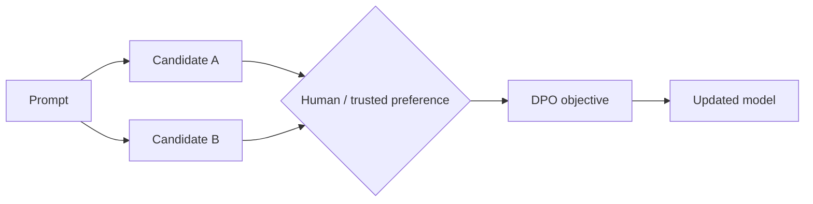

# Preference Data & Direct Preference Optimization

Preference training uses examples where one output is preferred over another for the same input. **Direct Preference Optimization (DPO)** trains the model toward preferred outputs relative to a reference behavior without requiring the classic explicit reward-model + RL loop.



```ts
type PreferenceExample = {
  prompt: string;
  chosen: string;
  rejected: string;
  rubricVersion: string;
};
```

## Data quality

Preference labels can encode annotator bias, style preferences or flawed rubrics. Collect disagreement and calibrate annotators instead of treating every pair as unquestionable ground truth.

## Practice

1. What information does a preference pair contain that SFT does not?
2. Why can low-quality preferences harm alignment?
3. How is DPO conceptually different from classical RLHF?
4. What metadata should be stored with preference examples?
