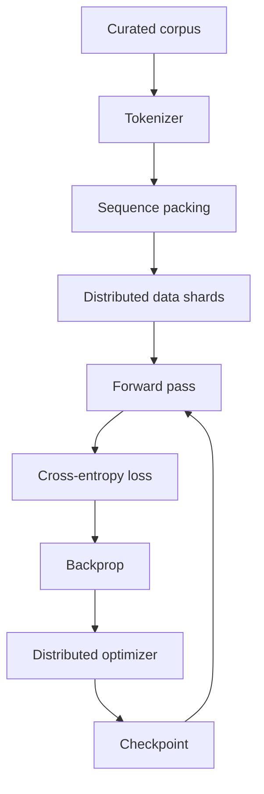

# LLM Pretraining Pipeline

Pretraining converts a large curated corpus into token sequences, batches them, predicts next tokens, computes loss and updates weights over huge numbers of tokens.



```ts
type PretrainingRun = {
  tokenizerVersion: string;
  datasetVersion: string;
  maxSequenceLength: number;
  tokensSeen: bigint;
  checkpoint: string;
};
```

## Sequence packing

Packing multiple shorter documents/examples into full sequences reduces wasted padding, but document boundaries and loss masking must be handled deliberately.

## Scale concerns

Pretraining adds data parallelism, tensor/model parallelism, optimizer-state sharding, mixed precision, checkpointing, fault recovery and cluster networking.

## Practice

1. Why is sequence packing useful?
2. What must be versioned to reproduce a pretraining run?
3. Why are total tokens processed more informative than epochs for web-scale corpora?
4. What failure recovery state belongs in a distributed checkpoint?
