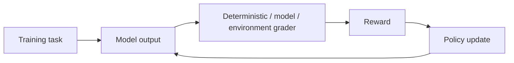

# Reinforcement Fine-Tuning & Grader Design

Reinforcement fine-tuning optimizes model behavior using task rewards rather than only imitation of a fixed target response. The critical engineering problem is designing a grader/reward that represents the task without becoming easy to game.



```ts
type GraderResult = {
  reward: number;
  passedHardConstraints: boolean;
  evidence: string[];
};
```

Prefer deterministic graders for executable code tests, schemas, exact facts or environment outcomes when available. Model graders are useful for subjective dimensions but need calibration and adversarial testing.

## Practice

1. What makes a reward function gameable?
2. When is an executable grader stronger than an LLM judge?
3. Why separate hard constraints from a scalar reward?
4. How would you detect reward hacking during training?
