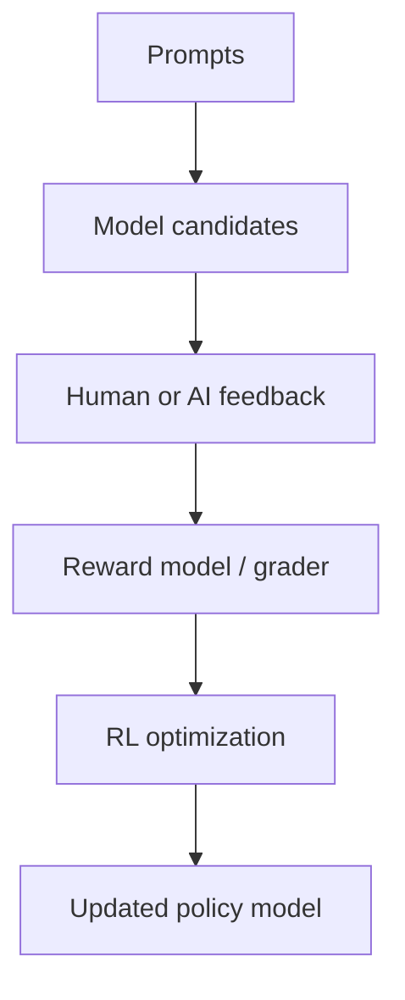

# RLHF, RLAIF & Reward Models

**RLHF** uses human preference signals to train a reward model or grader, then optimizes model behavior against that signal with reinforcement learning. **RLAIF** uses AI-generated feedback for some or all preference signals, usually under human-designed criteria.



```ts
type RewardSignal = {
  score: number;
  rubric: string;
  source: 'human' | 'ai' | 'deterministic';
};
```

## Reward hacking

If the reward signal is incomplete, optimization can exploit it. A model may learn behaviors that score well without satisfying true product intent.

## Practice

1. What role does the reward model play in classical RLHF?
2. What additional risk does AI-generated feedback introduce?
3. Define reward hacking with a concrete example.
4. Why must reward/grader versions be tracked during training?
