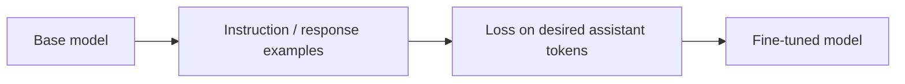

# Supervised Fine-Tuning (SFT)

**SFT** trains a pretrained model on input→desired-output examples so it learns task, instruction or conversational response patterns.



A training record might look like:

```ts
type SftExample = {
  messages: Array<{
    role: 'system' | 'user' | 'assistant';
    content: string;
  }>;
};
```

## Loss masking

Many chat fine-tuning recipes compute loss primarily on assistant response tokens rather than teaching the model to reproduce user/system text. Exact behavior depends on the training stack.

## When SFT helps

Use it for stable task behavior, format, domain language or instruction patterns after prompt/eval baselines exist. It is not the first choice for rapidly changing factual knowledge—that usually belongs in retrieval/tools.

## Practice

1. What changes during SFT: context or weights?
2. Why should SFT examples match deployment formatting/chat templates?
3. Why is SFT not a replacement for RAG?
4. What regression evals would you run after domain fine-tuning?
