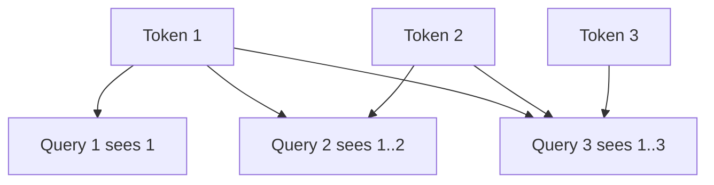

# Causal Masking & Autoregressive Attention

A decoder-only language model predicts token `t` using only allowed earlier/current positions. A **causal mask** blocks attention to future tokens during training.



Allowed-attention matrix:

```text
      k1 k2 k3 k4
q1     ✓  ✗  ✗  ✗
q2     ✓  ✓  ✗  ✗
q3     ✓  ✓  ✓  ✗
q4     ✓  ✓  ✓  ✓
```

```ts
function causalMask(length: number) {
  return Array.from({ length }, (_, q) =>
    Array.from({ length }, (_, k) => (k <= q ? 1 : 0)),
  );
}
```

## Training vs generation

Training can process many sequence positions in parallel because all target tokens are known, while masking prevents future leakage. Generation is sequential at the token level because each new token becomes input for the next decode step.

## Practice

1. What failure would occur if future tokens were visible during causal-LM training?
2. Why can training process a sequence in parallel while generation remains iterative?
3. How is causal masking different from padding masks?
4. Why is KV caching useful during causal generation?
