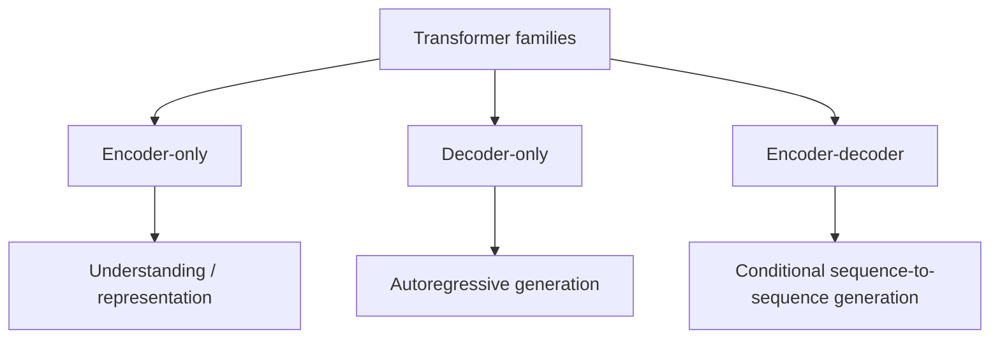

# Encoder, Decoder & Encoder-Decoder Models

Not every transformer is a decoder-only LLM.



## Encoder-only

Encoders read bidirectional context and are useful for representation, classification, tagging and embedding-style tasks.

## Decoder-only

Decoder-only models use causal attention and dominate general-purpose chat/coding LLMs because they naturally perform continuation and instruction-conditioned generation.

## Encoder-decoder

An encoder processes the source; a decoder generates target tokens while attending to encoded source representations. Translation and summarization have historically used this pattern extensively.

```ts
type ModelFamily = 'encoder' | 'decoder' | 'encoder-decoder';
function canAutoregressivelyGenerate(family: ModelFamily) {
  return family !== 'encoder';
}
```

## Practice

1. Why can an encoder look at both left and right context?
2. Why is a decoder-only architecture natural for chat generation?
3. What is cross-attention in an encoder-decoder system?
4. Which architecture would you consider for a lightweight text classifier?
