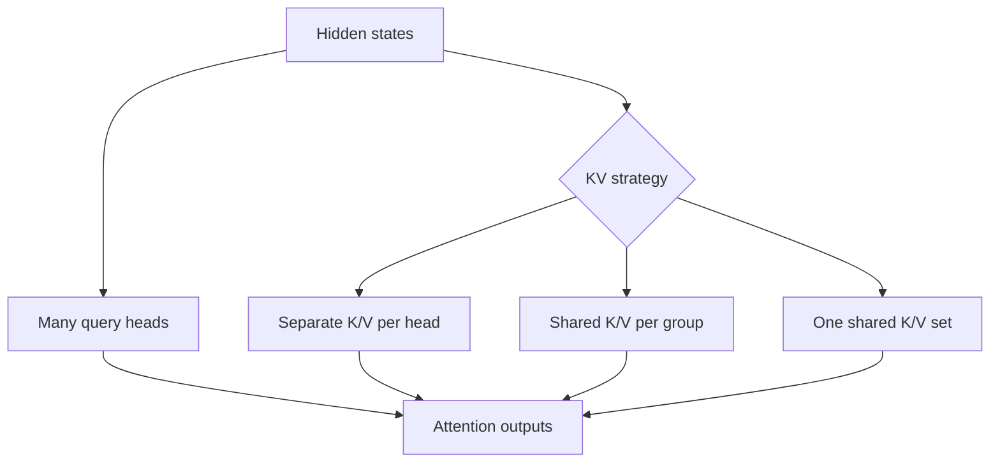

# Multi-Head, Multi-Query & Grouped-Query Attention

**Multi-Head Attention (MHA)** uses multiple attention heads, each with learned query, key and value projections. **Multi-Query Attention (MQA)** shares keys/values across query heads. **Grouped-Query Attention (GQA)** shares keys/values within groups, trading expressiveness for inference efficiency.



## Why GQA/MQA matter for serving

During autoregressive inference, previous keys/values are stored in KV cache. Fewer distinct KV heads reduce cache memory and bandwidth requirements.

```ts
function roughKvRatio(queryHeads: number, kvHeads: number) {
  return kvHeads / queryHeads;
}

console.log(roughKvRatio(32, 8)); // GQA stores roughly 1/4 as many KV-head values as MHA
```

This is a simplified ratio; actual cache size also depends on layers, head dimension, dtype, batch and sequence length.

## Practice

1. What does MQA share that MHA does not?
2. Why can GQA reduce serving memory?
3. Which workload benefits most from KV-head reduction: training or token-by-token inference?
4. Why is quality/latency trade-off architecture-specific?
