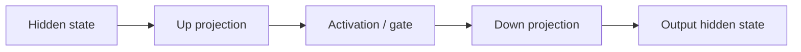

# Feed-Forward Networks, GELU & SwiGLU

Attention mixes information between token positions. The transformer's **feed-forward network (FFN/MLP)** then applies learned nonlinear transformations independently to each token position.



A simplified gated unit:

```ts
function silu(x: number) {
  return x / (1 + Math.exp(-x));
}

function gated(a: number[], b: number[]) {
  return a.map((v, i) => silu(v) * b[i]);
}
```

Modern model families may use GELU, SiLU/SwiGLU or other variants. SwiGLU-style MLPs use a learned gate and are common in contemporary decoder models.

## Why MLPs matter

A large fraction of model parameters and compute can live in MLP projections, especially in dense models. In Mixture-of-Experts architectures, the FFN role is often replaced by routed expert FFNs.

## Practice

1. Which transformer sublayer mixes across token positions?
2. Which sublayer applies a nonlinear transformation per position?
3. Why do activations matter in an otherwise linear stack of matrix multiplications?
4. How does an MoE architecture change the FFN story?
