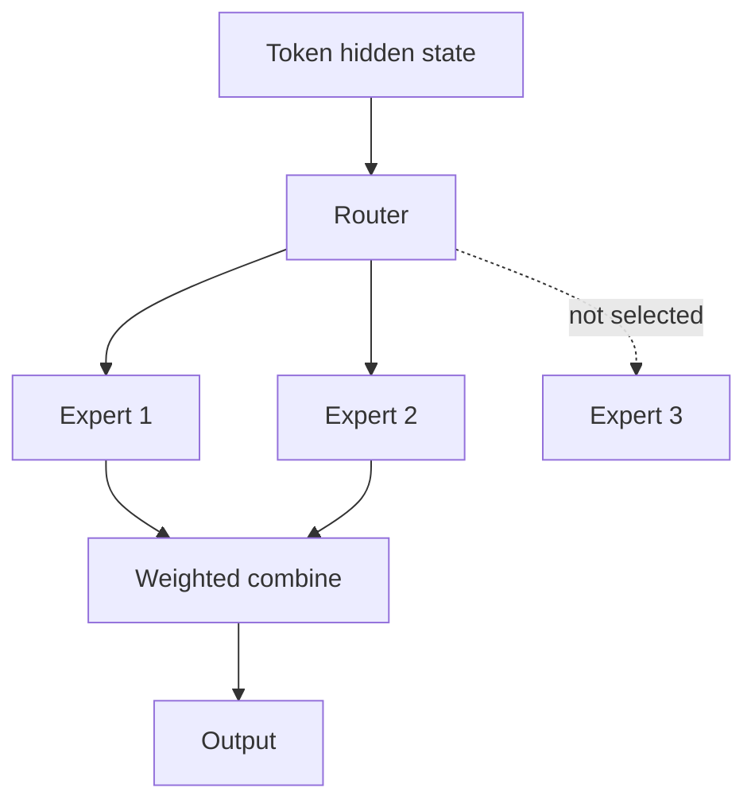

# Mixture of Experts (MoE)

A **Mixture-of-Experts** model contains multiple expert networks, but a router activates only a subset for each token. This creates high total parameter capacity without executing every parameter for every token.



```ts
type Score = { expert: string; score: number };
function topKExperts(scores: Score[], k: number) {
  return [...scores].sort((a, b) => b.score - a.score).slice(0, k);
}
```

## New engineering problems

MoE adds router balance, expert capacity, communication overhead and distributed expert placement. A model may have a very large total parameter count while activating far fewer parameters per token.

## Serving implications

Expert parallelism and interconnect bandwidth become important. Memory must often hold many experts even though only some execute for a token.

## Practice

1. Why can MoE increase parameter capacity without proportional FLOPs per token?
2. What is expert routing?
3. What happens if the router sends too many tokens to one expert?
4. Why can MoE serving require different distributed strategies from dense models?
