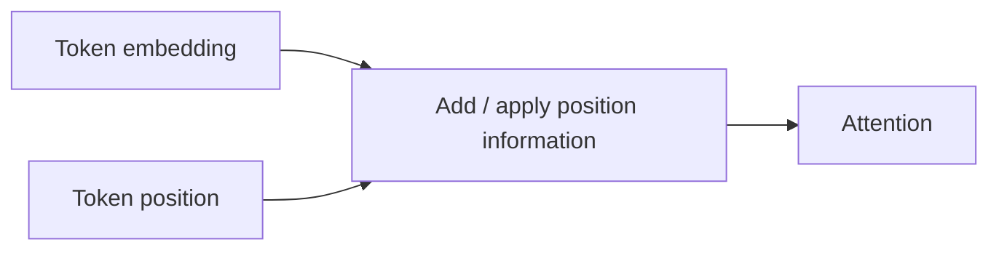

# Positional Encoding & RoPE

Attention by itself does not know token order. Transformers inject **positional information** so sequences with the same tokens in different orders produce different representations.



Approaches include learned absolute embeddings, sinusoidal encodings and **rotary positional embeddings (RoPE)**. RoPE rotates query/key dimensions according to position so relative position affects attention scores.

A toy positional feature—not RoPE itself—shows the principle:

```ts
function sinusoidal(position: number, dimension: number) {
  return Array.from({ length: dimension }, (_, i) =>
    i % 2 === 0
      ? Math.sin(position / 10_000 ** (i / dimension))
      : Math.cos(position / 10_000 ** ((i - 1) / dimension)),
  );
}
```

## Long-context caveat

Extending a context limit is not merely changing an integer. Positional method, training distribution, attention implementation and evaluation at long distances all matter.

## Practice

1. Why is positional information required?
2. What broad problem does RoPE solve?
3. Why can an advertised long context still perform poorly on distant evidence?
4. What should be re-evaluated after context-extension techniques are applied?
