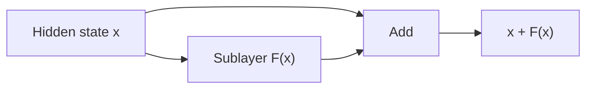

# Residual Connections, LayerNorm & RMSNorm

Deep transformers repeatedly transform hidden states. **Residual connections** preserve an identity path around a sublayer, while normalization controls activation scale and improves optimization stability.



```ts
function residual(x: number[], fx: number[]) {
  if (x.length !== fx.length) throw new Error('shape mismatch');
  return x.map((v, i) => v + fx[i]);
}
```

## LayerNorm vs RMSNorm

LayerNorm normalizes using mean and variance. RMSNorm uses root-mean-square scaling without subtracting the mean. Many modern LLM architectures use RMSNorm because it is simpler and works well at scale.

Do not infer quality from normalization choice alone; it is one part of an architecture/training recipe.

## Production relevance

Model architecture metadata matters for compatible quantization, conversion, serving kernels and fine-tuning adapters. A checkpoint is not just a pile of matrices with interchangeable semantics.

## Practice

1. What information path does a residual connection preserve?
2. Why does normalization help optimization?
3. How does RMSNorm conceptually differ from LayerNorm?
4. Why can architecture details matter when loading third-party checkpoints?
