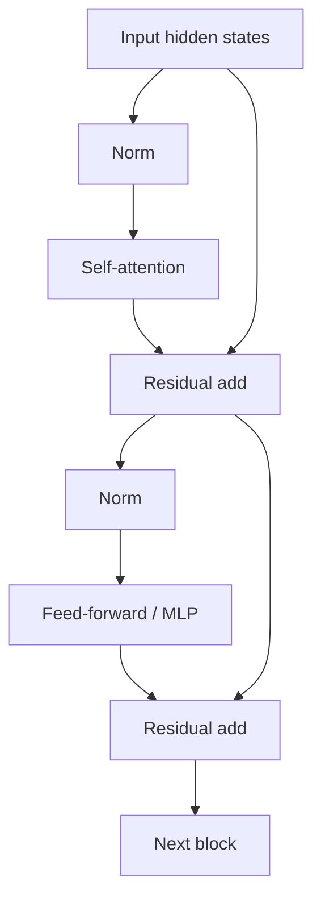

# Inside a Transformer Block

A decoder-only LLM stacks many transformer blocks. Each block mixes information across token positions with attention and transforms each position with an MLP, while residual connections and normalization stabilize deep computation.



A toy block interface:

```ts
type Matrix = number[][];

interface TransformerBlock {
  forward(hiddenStates: Matrix, causalMask: Matrix): Matrix;
}
```

Real implementations fuse kernels, use multiple heads, rotary position information, specialized normalization and optimized tensor layouts.

## Pre-norm vs post-norm

Architectures differ in whether normalization happens before or after sublayers. Modern large decoder models often use pre-normalization variants for training stability.

## Why app engineers should care

Block internals explain why context length affects attention work, why KV cache exists, why model architecture changes latency, and why quantization must account for different tensor types.

## Practice

1. What are the two major computational sublayers in a transformer block?
2. Why are residual connections useful in deep networks?
3. How does stacking blocks increase model depth?
4. Which block components create cross-token interaction versus per-token transformation?
