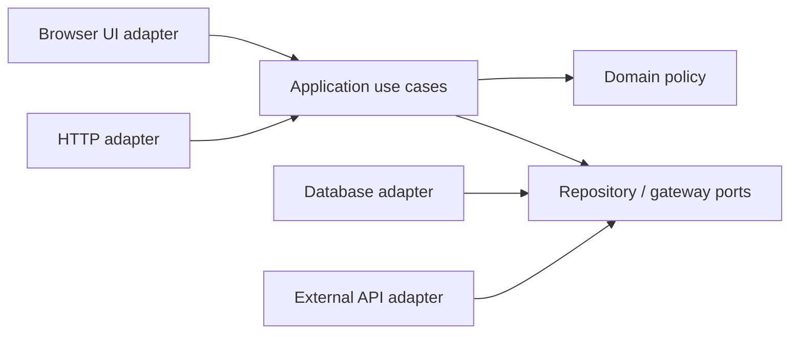

# JavaScript Application Architecture

Architecture defines boundaries, dependency direction and change cost. Choose it from product scale, team topology, deployment constraints and risk—not from diagram popularity.

## Modular and feature-based structure

A module should expose a small public contract and hide implementation. Feature slices keep UI, use cases and adapters for one capability close together while shared platform code remains explicit.

```text
src/
  checkout/
    domain/
    application/
    adapters/
    ui/
    index.js
  identity/
  platform/
```

Prevent imports into another feature’s private folders through lint rules or package exports.

## Layered, clean and hexagonal models

Layers group responsibilities such as presentation, application, domain and infrastructure. Clean/hexagonal architecture makes business policy depend inward on stable abstractions; adapters depend on ports.



JavaScript does not enforce interfaces at runtime. Use narrow documented contracts, validation and contract tests.

## Vertical slices

A vertical slice contains everything needed for one use case. It reduces cross-layer coordination but can duplicate small patterns. Extract shared abstractions only after stable repetition appears.

## MVC and MVVM

MVC separates input/controller, model and view responsibilities; exact ownership differs by platform. MVVM introduces a view model that exposes UI-ready state and commands. Framework names do not guarantee clean boundaries—trace actual dependencies and state ownership.

## State management

Separate server/cache state, URL/navigation state, local interaction state, persistent client state and derived values. Keep one source of truth for each fact, model transitions, and avoid copying remote data into multiple mutable stores.

## Error and configuration boundaries

Translate infrastructure failures into application outcomes; do not leak database/client errors through every layer. Validate configuration once at startup. Keep secrets server-side and use environment-specific adapters rather than scattered conditionals.

## Monorepos and packages

Monorepos help atomic changes and shared tooling but require ownership, dependency constraints and selective CI. Package boundaries should represent deployable/reusable contracts, not every folder.

## Observability and testing

Instrument use-case boundaries with correlation, duration and outcome. Unit-test pure policy, integration-test adapters, contract-test ports and use end-to-end tests for critical journeys. Architecture should make important behavior testable without booting the whole system.

## Deployment boundaries

A module boundary is not automatically a service boundary. Split deployments only when independent scaling, security, ownership or release cadence outweigh distributed-system cost.

## Review questions

Where does a dependency point? Who owns each state? Which failures cross the boundary? Can the domain run without the browser/database? What change requires touching the most modules?
