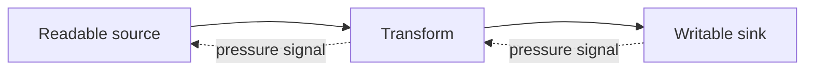

# Concurrency, Cancellation and Streams

JavaScript concurrency coordinates overlapping work on host facilities; it does not imply that ordinary code executes simultaneously on one event-loop thread. Workers provide parallel execution with separate agents and message-based data transfer.

## Cancellation

AbortController communicates cancellation through an AbortSignal. APIs should reject promptly, stop scheduling more work, clean up resources and preserve the signal’s reason where supported.

```javascript
async function fetchJson(url, {signal, timeoutMs = 5_000} = {}) {
  const timeoutSignal = AbortSignal.timeout(timeoutMs)
  const combined = signal
    ? AbortSignal.any([signal, timeoutSignal])
    : timeoutSignal
  const response = await fetch(url, {signal: combined})
  if (!response.ok) throw new Error(`HTTP ${response.status}`)
  return response.json()
}
```

Check compatibility for `AbortSignal.timeout` and `AbortSignal.any`, or compose equivalent behavior. A timeout is a deadline policy; it must abort underlying work rather than merely ignore its result.

## Bounded concurrency

Unlimited `Promise.all` can exhaust sockets, memory or rate limits. A worker-pool pattern limits in-flight tasks.

```javascript
async function mapLimit(items, limit, worker) {
  const results = new Array(items.length)
  let next = 0
  async function run() {
    while (true) {
      const index = next++
      if (index >= items.length) return
      results[index] = await worker(items[index], index)
    }
  }
  await Promise.all(Array.from({length: Math.min(limit, items.length)}, run))
  return results
}
```

Define whether one failure stops scheduling, aborts peers, or is collected.

## Retries and idempotency

Use capped exponential backoff with jitter for transient failures. Respect an overall deadline and `Retry-After`. A retry-safe operation needs idempotency at the system boundary; client code alone cannot make a duplicate payment safe.

## Debounce, throttle and polling

Debounce waits for quiet; throttle limits frequency. Preserve cancellation and final-call semantics. Polling should stop when hidden, disconnected or completed, back off after failures, and avoid overlapping requests.

## Web Streams

ReadableStream, WritableStream and TransformStream model chunked data and backpressure. A producer should honor desired size rather than enqueue without bound.



Use streaming for large files, incremental parsing and progressive responses, but define chunk boundaries, text decoding, error propagation and cancellation. Transferable streams and worker integration remain target-sensitive.

## Resource cleanup

Close readers, writers, event listeners, timers and locks on success, failure and cancellation. Explicit resource management syntax is Stage 4/living-draft work, so verify parser/runtime support before adopting `using` or `await using`.

## Primary references

- [WHATWG Streams](https://streams.spec.whatwg.org/)
- [DOM AbortController](https://dom.spec.whatwg.org/#interface-abortcontroller)
