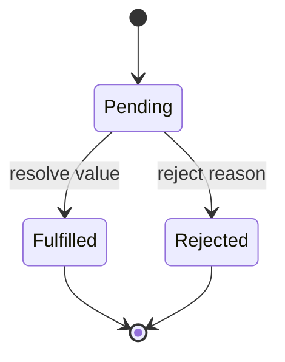

# Promises and Async/Await

A Promise represents one eventual settlement: fulfillment or rejection. Its reactions run as Jobs after the current synchronous execution completes.



Resolving with another Promise or thenable adopts its eventual state; it does not necessarily fulfill immediately. Calling `resolve` locks in the resolution path, while settlement may happen later.

## Chaining

`then`, `catch` and `finally` return new Promises. Returning a value fulfills the next link; throwing rejects it; returning a Promise flattens its outcome.

```javascript
const profile = await fetch('/api/profile').then(response => {
  if (!response.ok) throw new Error(`HTTP ${response.status}`)
  return response.json()
})
```

Fetch resolves for HTTP error status, so protocol validation remains your responsibility.

## Combinators

| Method | Policy |
|---|---|
| `Promise.all` | fulfill all in order; reject on first observed rejection |
| `allSettled` | wait for every result and expose each status |
| `race` | settle with the first settlement |
| `any` | fulfill with the first fulfillment; otherwise AggregateError |
| `withResolvers` | expose a Promise plus its resolving functions |
| `try` | invoke a callback and convert sync throw/result into a Promise |

A combinator does not cancel losing work. Connect every operation to a cancellation policy when abandoned work is expensive.

## Async functions

An async function always returns a Promise. `await` suspends that async continuation; it does not block the thread. Start independent work before awaiting it.

```javascript
const userPromise = loadUser(id)
const permissionsPromise = loadPermissions(id)
const [user, permissions] = await Promise.all([userPromise, permissionsPromise])
```

Use sequential awaits when order or dependency is real. In loops, decide deliberately between serial processing, unlimited concurrency and a bounded worker pool.

## Anti-patterns

- `new Promise(async resolve => ...)` creates confusing double error channels;
- forgetting `return` inside a `then` callback breaks the chain;
- `forEach(async item => ...)` does not await callback Promises;
- catching and returning `undefined` silently converts failure to success;
- using `race` for timeout without aborting the original operation leaks work.

## Top-level await

Top-level await is module-only and can delay evaluation of dependent modules. Keep startup dependencies explicit and avoid hidden cycles or slow network initialization in shared libraries.

## Primary references

- [ECMA-262 Promise objects](https://tc39.es/ecma262/#sec-promise-objects)
- [MDN promises](https://developer.mozilla.org/docs/Web/JavaScript/Guide/Using_promises)
