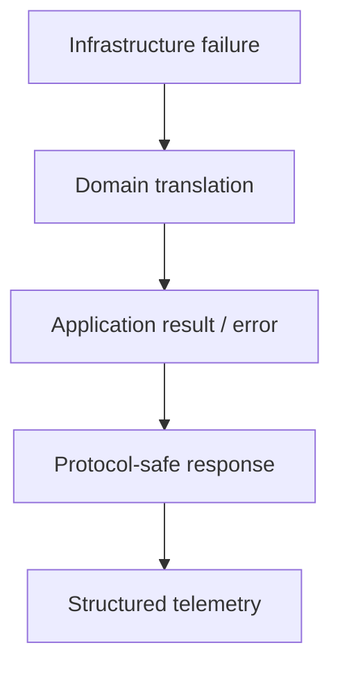

# Error Handling

A robust error strategy preserves cause, context and ownership. Syntax errors prevent parsing; runtime exceptions produce abrupt completion; logical errors return the wrong result without necessarily throwing.

```javascript
class PaymentDeclinedError extends Error {
  constructor(message, {cause, code} = {}) {
    super(message, {cause})
    this.name = 'PaymentDeclinedError'
    this.code = code
  }
}
```

## Throwing and catching

Throw Error objects rather than strings so callers receive a name, message, cause and implementation stack. Catch only where you can add context, translate the abstraction, recover, retry or terminate cleanly.

```javascript
try {
  await gateway.capture(payment)
} catch (cause) {
  throw new PaymentDeclinedError('Unable to capture payment', {
    cause,
    code: 'PAYMENT_CAPTURE_FAILED',
  })
}
```

`finally` runs during normal completion and abrupt completion. A `return` or `throw` inside `finally` can replace the earlier result—normally a serious mistake.

## Operational versus programmer errors

Operational errors include timeouts, unavailable dependencies and rejected user input; systems should handle them according to policy. Programmer errors include violated invariants and impossible states; hiding them with generic fallbacks can corrupt behavior. The distinction is contextual, not encoded by the Error class alone.

## Async failures

Promise rejections propagate through chains until handled. Always return or await Promises whose failure matters. “Floating” Promises need an explicit detached-task policy with logging and lifecycle ownership. Register process/browser unhandled-rejection hooks as last-resort telemetry, not normal control flow.

## Retry decisions

Retry only transient and idempotent work, cap attempts, use exponential backoff with jitter, honor cancellation and server retry guidance, and keep an overall deadline. Validation, authorization and business-rule failures are usually permanent.

## Normalization and serialization

External libraries can reject arbitrary values. Normalize at boundaries without discarding the original cause. Error properties are often non-enumerable, and stacks may contain sensitive paths or user data; create an explicit safe telemetry representation.

## Layer boundaries



Do not expose internal stack traces or secrets to users. Include correlation identifiers and actionable public messages while preserving full protected diagnostics for operators.

## Primary references

- [ECMA-262 Error objects](https://tc39.es/ecma262/#sec-error-objects)
- [MDN error handling](https://developer.mozilla.org/docs/Web/JavaScript/Guide/Control_flow_and_error_handling)
