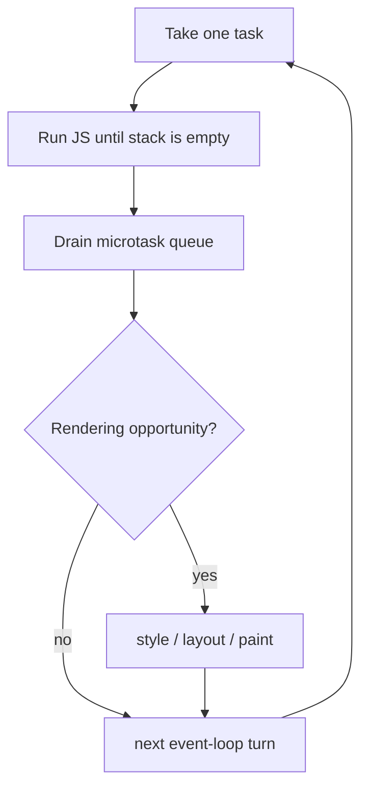

# JavaScript Event Loop

ECMAScript defines execution contexts and Jobs. Hosts define event loops, task sources, timers, rendering and I/O. “The JavaScript event loop” therefore has browser and runtime-specific integration.

```javascript
console.log('A')
setTimeout(() => console.log('B'), 0)
queueMicrotask(() => console.log('C'))
Promise.resolve().then(() => console.log('D'))
console.log('E')
// Browser-like ordering: A E C D B
```

## Browser model



Promise reactions, `queueMicrotask` and MutationObserver delivery use microtask checkpoints. User events, timers and networking callbacks enter host task queues. An infinite microtask chain can starve rendering and tasks.

Timers provide a minimum delay, not an execution guarantee. Background throttling, nested-timer clamping, busy work and scheduling policy can delay them.

`requestAnimationFrame` runs before a rendering opportunity and is appropriate for visual updates. `requestIdleCallback` is optional and deadline-sensitive; it is not suitable for required correctness work.

## Long tasks and yielding

Synchronous computation blocks input and rendering. Split work at useful boundaries, move CPU-heavy work to a Worker, or use a supported scheduling API. Yielding with a microtask does not let tasks or rendering run; yield to the host task scheduler.

## Node.js differences

Node integrates V8 Jobs with libuv phases. `process.nextTick` has a special queue that runs before ordinary Promise microtasks at Node-defined checkpoints and can starve I/O when recursively filled. `setImmediate` and `setTimeout(0)` ordering depends on phase and context. Consult the selected Node release rather than applying a browser diagram unchanged.

## Prediction method

1. Execute synchronous calls and record logs.
2. Enqueue Promise Jobs/microtasks in exact creation order.
3. Record host tasks by source.
4. Drain microtasks at the host checkpoint.
5. Consider rendering or runtime phases.
6. Repeat, including microtasks created by microtasks.

## Debugging

Use performance timelines, async stack traces and explicit timestamps. Do not infer order from log formatting alone when developer tools group or defer output.

## Primary references

- [ECMA-262 Jobs](https://tc39.es/ecma262/#sec-jobs-and-host-operations-to-enqueue-jobs)
- [WHATWG event loops](https://html.spec.whatwg.org/multipage/webappapis.html#event-loops)
- [Node.js event loop guide](https://nodejs.org/en/learn/asynchronous-work/event-loop-timers-and-nexttick)
