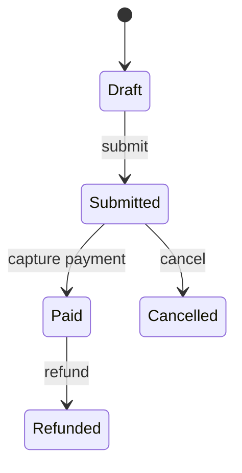

# Control Flow

Control flow determines which operations run and in what order. Prefer the simplest structure that makes valid states and exit conditions obvious.

## Branching

```javascript
function shippingPrice(order) {
  if (!order.items.length) return 0
  if (order.total >= 100) return 0
  if (order.destination === 'international') return 25
  return 8
}
```

Guard clauses flatten invalid or exceptional paths. `switch` is useful for one discriminant with several exact cases; a lookup table is often clearer for pure value mapping.

```javascript
const taxRate = {standard: 0.2, reduced: 0.05, exempt: 0}
const rate = taxRate[category]
if (rate === undefined) throw new RangeError('Unknown category')
```

## Loops

- `for...of` iterates values from an iterable;
- `for...in` enumerates string keys, including inherited enumerable keys, and is rarely right for arrays;
- classic `for` is useful when index and step are central;
- `while` expresses condition-driven repetition;
- `do...while` guarantees one execution.

```javascript
for (const invoice of invoices) {
  if (invoice.cancelled) continue
  if (invoice.amount > limit) break
  processInvoice(invoice)
}
```

Labels can exit nested structures but usually signal that extraction or another data model would be clearer.

## Recursion

Every recursive algorithm needs a base case and progress toward it. JavaScript engines do not provide reliable cross-platform proper-tail-call optimization, so deep unbounded recursion can overflow the stack. Prefer an explicit stack or queue for large trees and graphs.

## State machines

When behavior depends on a finite state, encode legal transitions rather than scattering nested conditions.



```javascript
const transitions = {
  draft: {submit: 'submitted'},
  submitted: {pay: 'paid', cancel: 'cancelled'},
  paid: {refund: 'refunded'},
}
```

## Review checklist

Can a branch be impossible? Is every loop bounded or cancellable? Are mutations localized? Would a polymorphic method or state machine remove repeated type checks? Is recursion safe for hostile input?

## Primary references

- [ECMA-262 statements](https://tc39.es/ecma262/#sec-ecmascript-language-statements-and-declarations)
- [MDN control flow](https://developer.mozilla.org/docs/Web/JavaScript/Guide/Control_flow_and_error_handling)
