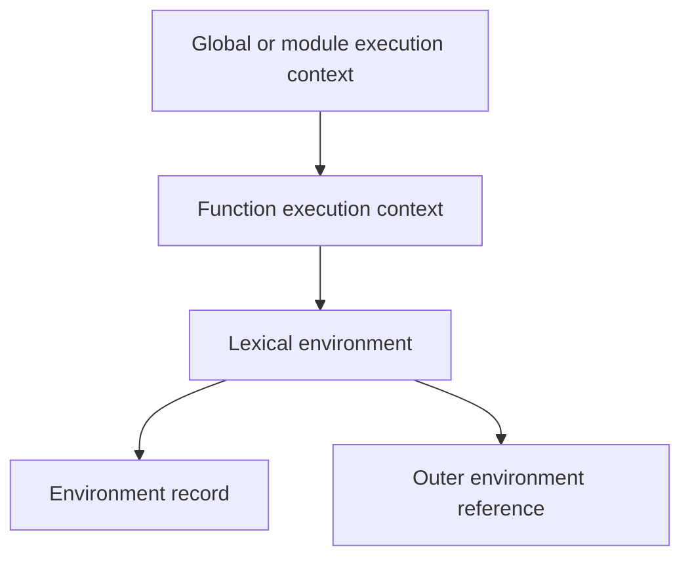

# Execution Contexts and Environments

An execution context is a specification record used to track evaluation. The running context stack changes as scripts, modules, functions and eval code execute. It is related to—but not identical with—an engine’s native machine stack.



## Context contents

A context tracks the current Realm, ScriptOrModule and function/code evaluation state. Function calls establish bindings for parameters, declarations, `this`, `super`, `arguments` and private environments according to the function kind.

## Environment records

Declarative records store lexical bindings. Object environment records expose an object’s properties as bindings in specific legacy/global situations. Function, module and global environment records add specialized behavior. The outer chain implements lexical name resolution.

## References

An identifier or property access can evaluate to a specification Reference Record. Operations then obtain or assign its value. This explains why a method call can preserve a base object for `this`, while extracting the function loses that call-site receiver.

```javascript
const method = object.method
object.method() // Reference has object base
method()        // plain call; no object base
```

## Declaration instantiation

Before statement execution, the language creates bindings. Function declarations can be initialized early; `var` is initialized to `undefined`; lexical/class bindings remain uninitialized. “Hoisting” is a teaching label for these distinct rules, not one physical source rewrite.

## Realms

A Realm contains its own global object and intrinsic objects. Values from an iframe can fail `instanceof Array` against another Realm’s Array constructor; use realm-safe brand operations such as `Array.isArray`.

## Direct eval and with

Direct eval can interact with the current environment according to strictness and code type. `with` inserts an object environment and is forbidden in strict mode because it makes name resolution unpredictable. Avoid both in modern application design.

## Debugging model

When paused, inspect Call Stack and Scope panels. Ask: which context is running, which environment supplies this binding, is the binding initialized, and what receiver did the call expression preserve?

## Primary references

- [ECMA-262 execution contexts](https://tc39.es/ecma262/#sec-execution-contexts)
- [ECMA-262 environment records](https://tc39.es/ecma262/#sec-environment-records)
