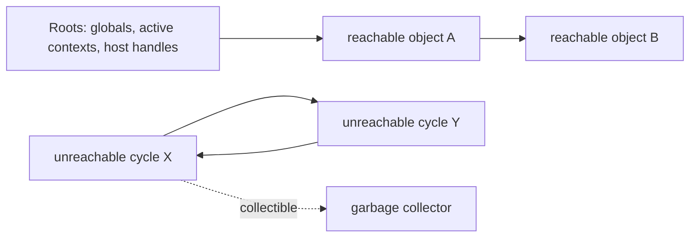

# Memory and Garbage Collection

JavaScript memory management is reachability-based. A value can be reclaimed when it is no longer reachable from roots through references. “Stack versus heap” is a useful approximation, not an ECMAScript storage guarantee.

Modern engines commonly use tracing, generations, incremental/concurrent work and compaction strategies. These are implementation details; code must not depend on collection timing.

## Common retention paths

- global caches without bounds;
- event listeners after UI teardown;
- timers and intervals capturing large state;
- closures retaining request or DOM graphs;
- detached DOM nodes referenced from JavaScript;
- pending Promises or queues that never settle/drain;
- accidental globals in non-strict legacy code;
- worker/message buffers copied instead of transferred.

## Weak collections

WeakMap and WeakSet do not keep keys alive and are ideal for object-associated metadata. They are intentionally non-enumerable. WeakRef exposes a weak reference but its target may disappear between turns; use only for optional caches, never correctness.

FinalizationRegistry schedules a cleanup callback after an object becomes unreachable, with no guarantee of promptness—or execution before shutdown. Finalizers must not release correctness-critical resources such as locks, files or transactions.

## Deterministic cleanup

Use explicit `close`, `dispose`, unsubscribe, AbortController and `try/finally` ownership. Explicit resource management (`using`, `await using`, DisposableStack) is Stage 4/living-draft work and requires verified syntax/runtime support.

## Profiling workflow

1. Reproduce a stable allocation scenario.
2. Record baseline and post-action heap snapshots.
3. Force GC only as a diagnostic aid where tooling permits.
4. Compare retained objects and inspect retaining paths.
5. Fix lifecycle ownership, then repeat under realistic load.

Allocation growth is not automatically a leak; caches, JIT warmup and delayed collection can be expected. A leak is memory retained beyond its useful lifetime.

## Production diagnostics

Track heap size, allocation rate, GC pause/CPU, event-loop delay and workload volume together. Capture evidence near an incident while respecting privacy; heap snapshots can contain secrets and user data.

## Primary references

- [ECMA-262 managing memory](https://tc39.es/ecma262/#sec-managing-memory)
- [MDN memory management](https://developer.mozilla.org/docs/Web/JavaScript/Guide/Memory_management)
- [V8 garbage collection](https://v8.dev/blog/trash-talk)
