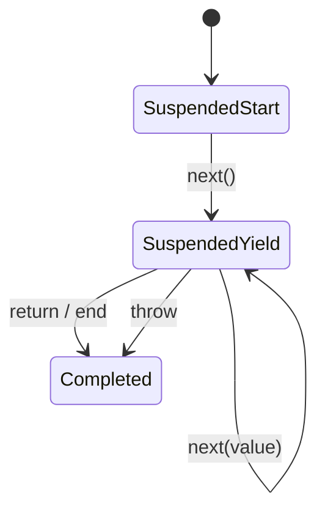

# Iterators and Generators

An iterable supplies `[Symbol.iterator]()`; the returned iterator supplies `next()` results shaped like `{value, done}`. This separation lets many consumers share one protocol.

```javascript
const range = {
  from: 1,
  to: 3,
  *[Symbol.iterator]() {
    for (let value = this.from; value <= this.to; value += 1) yield value
  },
}
console.log([...range]) // [1, 2, 3]
```

Generators are state machines expressed with `function*` and `yield`. `yield*` delegates to another iterable and forwards completion behavior.



## Laziness

Iterators can process large or infinite sequences without materializing everything. Laziness moves work to consumption time, so errors and side effects occur later than a normal eager function call.

## Cleanup

When `for...of` exits early, the consumer can call the iterator’s `return()` method. Generators run `finally` during this close operation. Custom iterators that own files, locks or subscriptions should implement deterministic cleanup.

## Iterator helpers

Standard iterator helpers provide lazy `map`, `filter`, `take`, `drop`, `flatMap`, `reduce`, `some`, `every`, `find` and conversion operations. `Iterator.concat` is standardized in ES2026. Joint iteration methods such as `zip` belong to finished/living-draft work; verify the target baseline before use.

## Async iteration

An async iterable supplies `[Symbol.asyncIterator]`; its `next()` results are awaited. `for await...of` is suitable for paginated APIs, streams and event sources.

```javascript
async function* fetchPages(load, signal) {
  let cursor
  do {
    const page = await load(cursor, signal)
    yield page.items
    cursor = page.nextCursor
  } while (cursor)
}
```

Cancellation and backpressure are not automatic. Pass an AbortSignal, stop producing when the consumer closes, and avoid unbounded prefetching.

## Trade-offs

Use generators when pause/resume semantics and laziness simplify the problem. Prefer arrays and ordinary functions when the data is already small and eager; hidden generator control flow can make debugging and typing contracts harder.

## Primary references

- [ECMA-262 iteration](https://tc39.es/ecma262/#sec-iteration)
- [MDN iterators and generators](https://developer.mozilla.org/docs/Web/JavaScript/Guide/Iterators_and_generators)
