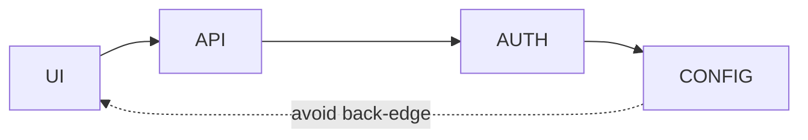

# ES Modules and Package Management

ES modules have lexical scope, strict semantics and a statically analyzable dependency graph. Imports are live read-only views of exported bindings, not copied values.

```javascript
// counter.js
export let count = 0
export function increment() { count += 1 }

// app.js
import {count, increment} from './counter.js'
increment()
console.log(count) // 1
```

## Export and import forms

Prefer named exports for discoverability and refactoring; default exports are valid when a module has one clear primary value. Namespace imports group bindings. Re-exports can build a public surface, but large “barrel” modules may introduce cycles and unnecessary loading.

Dynamic `import()` returns a Promise and enables conditional loading/code splitting. Static imports remain the best default for required dependencies.

## Evaluation graph and cycles

Modules are linked before evaluation. Cycles are legal, but reading a lexical export before its module initializes can throw. Avoid initialization-time calls across cycles; extract shared contracts or invert the dependency.



Top-level await makes dependent module evaluation asynchronous and can amplify waterfalls. Use it for genuine startup prerequisites, not hidden general I/O in libraries.

## Import attributes and JSON modules

Import attributes are standardized and let hosts identify module type, including JSON modules. Exact syntax, MIME/security checks and runtime support remain compatibility-sensitive. Test browser, Node, Deno, Bun and bundler targets separately.

## Node package boundaries

In Node, package `type`, `.mjs`, `.cjs`, `exports`, `imports` and conditional exports influence resolution. Avoid publishing ambiguous dual packages with separate mutable singleton state. Test both import and require entry points when supporting both systems.

## npm concepts

`dependencies` are runtime requirements, `devDependencies` support development/build, `peerDependencies` express a host compatibility relationship, and optional dependencies must have fallback behavior. Commit the lockfile for applications and CI, review lifecycle scripts, minimize package count and pin trusted release workflows.

Semantic version ranges communicate compatibility intent, not proof. Run tests and security review for updates, especially transitive and build-time dependencies.

## Tree shaking

Tree shaking depends on static structure and accurate side-effect metadata. Do not mark a package side-effect-free if importing it registers globals, styles or polyfills.

## Primary references

- [ECMA-262 modules](https://tc39.es/ecma262/#sec-ecmascript-language-scripts-and-modules)
- [npm package.json](https://docs.npmjs.com/cli/configuring-npm/package-json)
- [Node.js packages](https://nodejs.org/api/packages.html)
