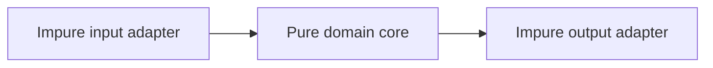

# Functional Programming

Functional programming emphasizes values, transformations and explicit effects. JavaScript is multi-paradigm; use functional techniques where they make state and dependencies easier to reason about.

## Purity and referential transparency

A pure function depends only on arguments and produces no observable external effect. Referential transparency means an expression can be replaced by its value without changing behavior.

```javascript
function calculateDiscount({subtotal, customerTier}) {
  const rate = customerTier === 'gold' ? 0.15 : 0.05
  return Math.round(subtotal * rate)
}
```

Clock reads, randomness, mutation, network calls and logging are effects. Push them to adapters and pass their results into the pure core.



## Immutability

Immutable updates preserve old values and make change explicit. They can increase allocation and copying, so choose data structures and boundaries carefully rather than cloning everything recursively.

```javascript
const nextState = {
  ...state,
  orders: state.orders.map(order =>
    order.id === id ? {...order, status: 'paid'} : order
  ),
}
```

## Higher-order design

Composition connects compatible functions. Partial application fixes dependencies or policy. Currying is useful for reusable unary pipelines but can obscure ordinary APIs.

```javascript
const pipe = (...functions) => input =>
  functions.reduce((value, fn) => fn(value), input)
```

## Option and Result

When absence or expected failure is part of the domain, tagged values can make every branch explicit.

```javascript
const ok = value => ({ok: true, value})
const err = error => ({ok: false, error})

function parseQuantity(value) {
  const number = Number(value)
  return Number.isInteger(number) && number > 0
    ? ok(number)
    : err('Quantity must be a positive integer')
}
```

This is a practical algebraic-data-type pattern by convention. It does not require turning every exception into a nested monadic abstraction.

## Pipelines and transducers

Array pipelines are readable for moderate data. They allocate intermediate arrays. For large streams, combine operations in one loop, use iterator helpers, a generator, a stream transform or a transducer-style reducer only when measurement justifies the complexity.

## Architecture

Keep domain decisions pure, represent commands and events as data, inject I/O functions, and make effects visible in names and return types. Property-based tests are particularly effective for pure invariants.

## Trade-offs

Avoid dogma: mutation inside a well-owned local algorithm can be simpler and faster; classes can model identity; exceptions can represent unexpected failures. The goal is controlled effects and understandable state, not maximum abstraction.

## Primary references

- [ECMA-262 functions](https://tc39.es/ecma262/#sec-ecmascript-language-functions-and-classes)
- [MDN functional programming glossary](https://developer.mozilla.org/docs/Glossary/Functional_programming)
