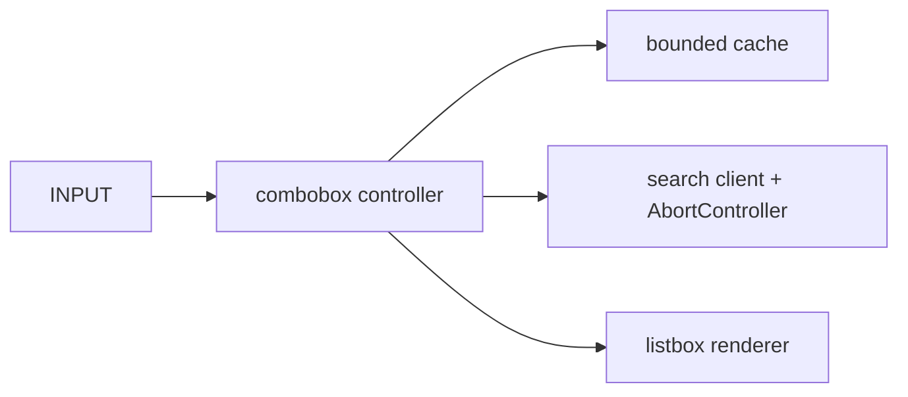

# Accessible Autocomplete Search

## Goals
Build an accessible autocomplete that handles keyboard interaction, async races, cancellation, caching and progressive enhancement without a framework.

## Requirements
Debounced remote search, minimum query length, highlighted suggestion, recent searches, loading/empty/error states, mouse and keyboard selection, and URL navigation.

## User Stories
A screen-reader user hears result count and active option. A keyboard user moves with arrows, selects with Enter and closes with Escape. Slow old responses never replace newer results.

## Architecture


## Directory Structure
```text
src/{autocomplete.js,state-machine.js}
src/ui/{combobox-view.js,focus.js}
src/data/{search-client.js,lru-cache.js}
tests/{state-machine.test.js,combobox.spec.js}
```

## Module Boundaries
The state machine owns open/highlight/loading transitions; the client owns HTTP/cancellation; the view owns DOM/ARIA; navigation is injected.

## State Model
`idle → debouncing → loading → results|empty|error`; parallel fields store query, requestId, options and activeIndex.

## Data Model
Suggestion: `{id,label,description,url}`. Cache entries include query, normalized results and expiry.

## APIs
`createAutocomplete({input,listbox,search,navigate,debounceMs,signal})`; `search(query,{signal})` returns validated suggestions.

## Validation
Normalize whitespace, cap query length, require HTTPS/same-origin safe result URLs and validate response shape.

## Error Handling
Abort superseded requests, ignore stale request IDs, distinguish offline/timeout/server/schema failures and keep manual form submission available.

## Accessibility
Implement the ARIA combobox/listbox pattern, `aria-expanded`, `aria-controls`, `aria-activedescendant`, stable option IDs, status live region and pointer/keyboard parity.

## Security
Use `textContent`, parse URLs with `new URL`, allowlist protocols/origins, never inject server-provided highlight HTML and avoid query leakage to logs.

## Performance
Debounce intent, cache bounded normalized queries, render only the limited result set and avoid layout reads during key handling.

## Testing
State-machine unit tests, fake-timer debounce tests, mocked network races and real-browser tests for roles, names, focus and every key path.

## Deployment
Publish as an ESM module plus demo page, document required markup/CSS and run accessibility checks in CI.

## Failure Scenarios
IME composition, response reordering, duplicate labels, removed active option, network transition during typing and component destruction mid-request.

## Extensions
Grouped options, multi-select tokens, local fuzzy search in a Worker and pluggable ranking.

## Interview Discussion Points
Defend `aria-activedescendant`, explain race prevention, debounce versus throttle, cache invalidation and why visual behavior alone is insufficient.
