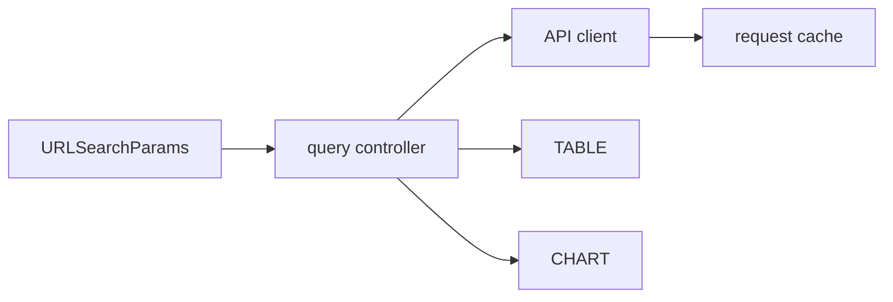

# Data Dashboard with Filtering and Pagination

## Goals
Build a resilient dashboard that separates URL state, remote cache state, derived view state and rendering.

## Requirements
Server pagination, sorting, filters, date range, accessible table, summary cards, chart, shareable URLs, export and responsive loading/error states.

## User Stories
A user can share a filtered URL, navigate Back/Forward without losing state, cancel a slow query by changing filters and export exactly the current result set.

## Architecture


## Directory Structure
```text
src/{app.js,query-state.js}
src/data/{api-client.js,cache.js,schema.js}
src/ui/{filters.js,table.js,paginator.js,chart.js}
src/export/{csv.js}
```

## Module Boundaries
Query-state parses/serializes URL; API client handles HTTP/schema/cancellation; UI modules render semantic views; export consumes domain rows, not DOM.

## State Model
URL owns filters/page/sort. Cache owns request status/data/error by canonical query key. Selection and disclosure remain local UI state.

## Data Model
`Page<{id,name,status,amount,createdAt}>` with `{items,total,page,pageSize}`; use integer minor currency units.

## APIs
`loadPage(query,{signal})`, `replaceQuery(partial)`, `exportRows(query,{signal,onProgress})`.

## Validation
Clamp page size, allowlist sort fields/directions, validate ISO dates and response records, and encode query values with URLSearchParams.

## Error Handling
Keep previous data during refresh when appropriate, expose retry, abort stale fetches, and distinguish invalid filters from server/unavailable failures.

## Accessibility
Use table headers/scope, caption, labelled filters, current-page indication, live result count, keyboard-accessible chart summary and non-color status cues.

## Security
Never build HTML from API cells, prevent formula injection in CSV by escaping dangerous leading characters, and authorize export server-side.

## Performance
Cache canonical queries, prefetch adjacent pages only within a budget, aggregate on the server for large datasets, lazy-load chart code and profile DOM updates.

## Testing
Round-trip URL tests, schema/client integration tests, race tests, CSV security tests, table accessibility tests and E2E history navigation.

## Deployment
Set environment-specific API base/config, CSP/connect-src, error monitoring and real-user performance budgets.

## Failure Scenarios
Invalid bookmarked query, total shrinking below current page, partial export, stale cache after mutation and chart library failure.

## Extensions
Saved views, column customization, Web Worker export, realtime updates and offline read-only cache.

## Interview Discussion Points
Explain state categories, URL canonicalization, server versus client pagination, stale-response defense and accessible data visualization.
