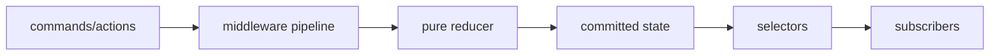

# Custom Event and State Management Library

## Goals
Build a compact observable store to learn reducers, event ordering, selector subscriptions, middleware and immutable update contracts.

## Requirements
Dispatch, subscribe/unsubscribe, reducers, derived selectors, batched notifications, middleware, devtools history, async command helper and module composition.

## User Stories
A subscriber receives consistent committed state, can unsubscribe safely during notification and is not called when its selected value is unchanged.

## Architecture


## Directory Structure
```text
src/{create-store.js,combine-reducers.js}
src/{selectors.js,middleware.js,batch.js}
src/devtools/{history.js,serialize.js}
tests/{ordering.test.js,selectors.test.js}
```

## Module Boundaries
Reducer is pure and synchronous. Store owns commit/notification. Middleware wraps dispatch. Async helpers dispatch lifecycle actions but do not mutate state directly.

## State Model
One immutable root value plus listener records `{selector,equality,lastValue,callback}` and dispatch/batch flags.

## Data Model
Action: `{type,payload?,meta?,error?}`. Require serializable actions only when history/persistence features are enabled.

## APIs
`createStore(reducer,preloaded,{middleware})`, `dispatch`, `getState`, `subscribe`, `batch`, `replaceReducer`; subscription returns cleanup.

## Validation
Require object actions with string/Symbol type, reject reducer `undefined`, guard nested dispatch policy and validate middleware shape.

## Error Handling
If reducer throws, keep previous state and propagate. Define whether listener errors are aggregated after all listeners or stop dispatch; document the choice.

## Accessibility
The library is UI-neutral; its demo must show derived announcements without duplicating every state change into noisy live regions.

## Security
Do not eval actions or accept arbitrary reducer code from untrusted sources. Redact secrets from devtools/history and prevent prototype-path merges.

## Performance
Use selector equality, structural sharing and batched notification. Avoid deep-cloning state and bound history size.

## Testing
Ordering tests for subscribe/unsubscribe during dispatch, reducer property tests, listener-error policy, batch semantics and memory cleanup via retained-listener checks.

## Deployment
Publish ESM, documented TypeScript declarations generated separately if desired, zero hidden globals and minified-size budget.

## Failure Scenarios
Nested dispatch, reducer replacement, subscriber adds/removes itself, selector throws, middleware invokes next twice and history contains unserializable data.

## Extensions
Persistence plugin, cross-tab BroadcastChannel adapter, time travel, computed signals and framework bindings.

## Interview Discussion Points
Explain notification snapshotting, structural sharing, selector equality, middleware reentrancy and why global state should remain limited.
