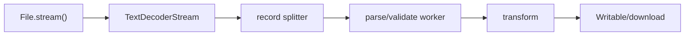

# File Processing and Streaming Tool

## Goals
Process files larger than available memory using streaming decode, parse, validate, transform and output stages.

## Requirements
CSV and JSON Lines input, encoding detection policy, schema validation, progress, cancellation, worker parsing, error report and streamed output/download.

## User Stories
A user transforms a multi-gigabyte file without freezing the page, can cancel safely and receives row-level errors without losing valid output.

## Architecture


## Directory Structure
```text
src/pipeline/{create-pipeline.js,records.js}
src/formats/{csv.js,jsonl.js}
src/worker/{parser-worker.js,protocol.js}
src/ui/{picker.js,progress.js,errors.js}
```

## Module Boundaries
Format modules parse chunks/records; schema module validates plain records; worker protocol transfers bounded batches; UI never parses data; sink owns output lifecycle.

## State Model
Idle, reading, processing, paused-by-backpressure, cancelling, completed or failed; counters track bytes/rows/valid/invalid.

## Data Model
Result row plus Issue `{row,column,code,message,sample}`. Cap samples and never keep all original rows in memory.

## APIs
`processFile(file,{format,schema,transform,signal,onProgress,sink})`; transform can return skip/error/output.

## Validation
Check file size/type only as hints, enforce row/field/depth limits, handle quoted CSV boundaries across chunks and validate every parsed record.

## Error Handling
Distinguish malformed encoding, parse issue, schema issue, worker crash and sink failure. Cancel upstream on fatal downstream error and close/abort writers.

## Accessibility
File controls have labels, progress uses native progress/status semantics, cancellation is keyboard-accessible and error summaries have downloadable detail.

## Security
Do not execute spreadsheet formulas; prefix dangerous CSV cells on export, sanitize filenames, avoid HTML previews, cap decompression/record expansion and treat MIME as untrusted.

## Performance
Honor stream backpressure, transfer ArrayBuffers where possible, batch worker messages, throttle progress rendering and benchmark throughput/memory.

## Testing
Chunk-boundary fuzz tests, malformed Unicode/CSV tests, cancellation at every stage, worker crash simulation, memory budget test and browser E2E with generated files.

## Deployment
Serve worker modules and assets with correct MIME/CSP, support modern browsers, and provide a Node stream adapter as a separate entry if needed.

## Failure Scenarios
Quoted record spans chunks, final line lacks newline, sink quota fills, worker responds after abort and malformed record causes unbounded buffer.

## Extensions
ZIP ingestion with safeguards, column mapping UI, parallel partitioning, upload streaming and resumable checkpoints.

## Interview Discussion Points
Explain backpressure, chunk framing, transfer versus clone, worker isolation limits, CSV injection and memory measurement.
