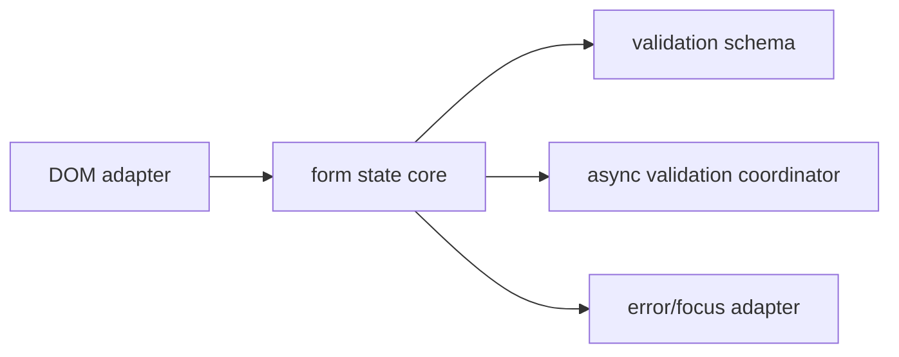

# JavaScript Form and Validation Library

## Goals
Design a small library that separates value extraction, synchronous/async validation, error presentation and submission lifecycle.

## Requirements
Field schemas, cross-field rules, async validators, touched/dirty state, cancellation, nested paths, serialization, custom controls and accessible rendering adapters.

## User Stories
A developer can validate a form without DOM coupling. A user receives errors at the field and summary, and stale username checks never overwrite the latest value.

## Architecture


## Directory Structure
```text
src/core/{form.js,state.js,paths.js}
src/validation/{schema.js,rules.js,async.js}
src/adapters/{dom.js,errors.js}
tests/{core.test.js,dom.spec.js,types.test.js}
```

## Module Boundaries
Core accepts plain values/events and has no DOM import. Rules return normalized issues. DOM adapter extracts values and applies accessibility attributes. Submission is injected.

## State Model
Per field: `{value,initialValue,touched,dirty,validating,issues}`. Form: `{status,submitCount,issuesByPath}`.

## Data Model
Issue: `{path,code,message,meta}`. Schema maps paths to parsers/rules and includes form-level validators.

## APIs
`createForm({initialValues,schema,onSubmit})`, `setValue`, `blur`, `validate`, `submit`, `subscribe`, `registerField`; async validators receive `{signal,values}`.

## Validation
Parse before refine, preserve multiple issues where useful, run cross-field rules against a consistent snapshot and avoid treating client validation as authorization.

## Error Handling
Convert expected validation failures to issues; propagate programmer errors; abort stale async checks; expose submission failure separately from field invalidity.

## Accessibility
Connect inputs with `aria-describedby`, set `aria-invalid`, render a linked error summary, move focus only on failed submission and support native controls first.

## Security
Never render rule messages as HTML, validate server-side, prevent prototype-path writes, cap nested depth and avoid sending sensitive values to remote validators unnecessarily.

## Performance
Notify path subscribers selectively, debounce only expensive async checks, memoize compiled schemas and bound validation concurrency.

## Testing
Table-test rules, property-test parsers, fake async race/cancellation, DOM role/name/error linking and package export tests.

## Deployment
Publish ESM with explicit exports, side-effect metadata, semantic versions, generated API docs and browser/runtime support matrix.

## Failure Scenarios
Field removed during async validation, server issues for unknown paths, repeated submission, reset during request and custom control with invalid event shape.

## Extensions
Plugin rule packs, locale message catalogs, JSON Schema adapter and React/Vue adapters that keep core independent.

## Interview Discussion Points
Explain parser versus validator, async race handling, accessible error strategy, package API stability and why server validation remains mandatory.
