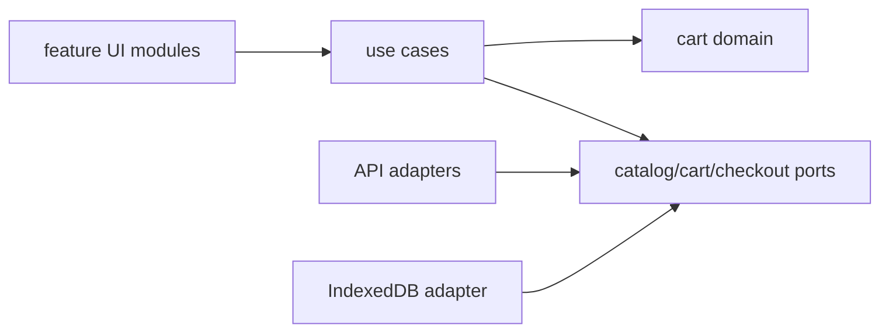

# Modular E-Commerce Frontend

## Goals
Integrate the handbook into a production-style storefront with catalog, search, cart, checkout handoff and resilient module boundaries.

## Requirements
Product listing/detail, filters, pagination, cart, inventory refresh, guest persistence, authenticated merge, optimistic updates, checkout redirect and analytics consent.

## User Stories
A user can shop with keyboard, recover a cart after reload, receive clear price/inventory changes and never see card secrets handled by the storefront.

## Architecture


## Directory Structure
```text
src/features/{catalog,product,cart,checkout}/
src/domain/{money.js,cart.js,inventory.js}
src/platform/{http.js,storage.js,telemetry.js}
src/app.js
```

## Module Boundaries
Features import public domain/application contracts, never another feature’s private UI. Platform adapters depend inward. Checkout provider integration is isolated behind a port.

## State Model
URL owns catalog filters; remote cache owns products/inventory; cart domain owns lines/version/pricing status; local UI owns dialogs and focus.

## Data Model
Money uses integer minor units plus currency. Cart line stores product/variant IDs, quantity and last quoted price; server response is authoritative.

## APIs
`catalog.search(query,{signal})`, `cart.quote(lines,{signal})`, `cartRepository.load/save`, `checkout.createSession(cartVersion)`.

## Validation
Allowlist sort/filter values, validate API schemas, enforce quantity boundaries, reprice/revalidate inventory server-side and parse only trusted checkout URLs.

## Error Handling
Abort stale searches, retain recoverable cart edits, handle quote conflicts, show retry/offline state and prevent duplicate checkout session creation with idempotency.

## Accessibility
Semantic landmarks, product headings, labelled filters, status announcements, accessible cart dialog/focus restoration, form errors and no hover-only information.

## Security
Safe DOM rendering, strict CSP, no frontend secrets, HttpOnly session design where applicable, CSRF protection, dependency review, consent-aware analytics and payment-provider hosted fields/redirect.

## Performance
Code-split checkout/admin-only features, optimize images, cache catalog pages, prefetch cautiously, avoid duplicate state and monitor interaction/render metrics.

## Testing
Domain price/cart unit tests, API contract tests, mocked inventory races, accessibility browser tests and critical purchase E2E against a sandbox provider.

## Deployment
Immutable assets, environment config validation, CSP/SRI where applicable, source-map policy, feature flags, error monitoring and rollback-ready releases.

## Failure Scenarios
Inventory changes after add, price/currency mismatch, cart merge conflict, duplicate submit, checkout callback tampering and analytics failure.

## Extensions
Wishlist, recommendations with privacy review, offline catalog, multi-currency display, plugin promotions and server-rendered shell.

## Interview Discussion Points
Explain state taxonomy, trust boundaries, payment isolation, idempotency, modular versus micro-frontend decisions and performance budgets.
