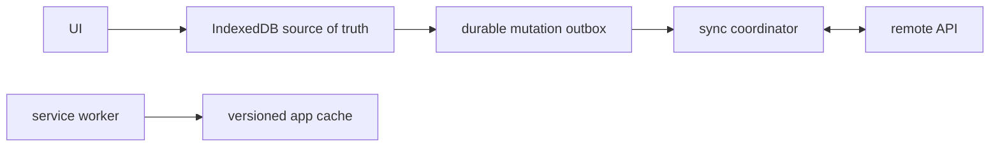

# Offline-First Notes Application

## Goals
Build a notes application where local writes succeed offline and synchronize safely when connectivity returns.

## Requirements
Create/edit/search/archive notes, attachments, offline app shell, local full-text index, sync queue, conflict UI, import/export and schema migrations.

## User Stories
A user edits on a train with no network, closes the tab and later sees changes sync. Conflicting edits are never silently overwritten.

## Architecture


## Directory Structure
```text
src/domain/{note.js,merge.js}
src/data/{db.js,migrations.js,outbox.js}
src/sync/{coordinator.js,api.js}
src/ui/{editor.js,list.js,conflicts.js}
sw.js
```

## Module Boundaries
UI writes through a local repository; outbox records intent atomically with data; sync owns network/retry; service worker owns request caching, not domain state.

## State Model
Local note status: clean, pending, syncing, conflict or failed. Sync coordinator has idle/running/backoff/offline states.

## Data Model
Note: `{id,title,body,updatedAt,baseVersion,localVersion,deletedAt}`. Outbox entry: `{operationId,noteId,type,payload,attempt,nextAttemptAt}`.

## APIs
`notes.transaction`, `outbox.enqueue`, `sync.run({signal})`, remote idempotent `PUT /notes/:id` with version precondition.

## Validation
Bound note/attachment sizes, validate migrations/imports, normalize timestamps and reject unsupported schema versions.

## Error Handling
Persist failed mutations, use capped retry with jitter, pause on authorization errors and surface conflicts with local/remote/base comparison.

## Accessibility
Editor has labels and status announcements; conflict chooser is keyboard-operable; offline/sync state is conveyed without color alone.

## Security
Escape note content, sanitize optional rich text, encrypt transport, avoid claiming client-side encryption protects data from code running in the origin, and restrict attachment types.

## Performance
Index metadata separately, debounce search indexing, stream attachments, avoid loading all bodies, and update caches incrementally.

## Testing
Migration rollback tests, fake offline transitions, deterministic sync state-machine tests, service-worker browser tests and conflict E2E journeys.

## Deployment
Version service-worker caches, support rollback-compatible data schemas, serve over HTTPS and monitor sync failure rates.

## Failure Scenarios
Tab closes mid-transaction, duplicate retry, server version conflict, quota eviction, broken migration and old service worker with new assets.

## Extensions
End-to-end encrypted collaboration, CRDT merge, background sync where available and shared-worker coordination.

## Interview Discussion Points
Explain local source of truth, outbox atomicity, idempotency, cache versus data storage, conflict policy and safe service-worker updates.
