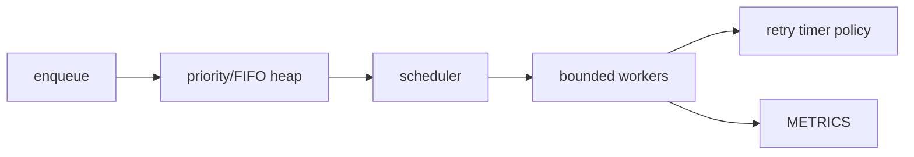

# Promise-Based Task Queue

## Goals
Build a reusable queue that limits in-flight async tasks and makes cancellation, priority, retries and shutdown explicit.

## Requirements
Concurrency limit, FIFO within priority, pause/resume, per-task AbortSignal, deadlines, retries with jitter, drain/idle Promises, metrics and graceful close.

## User Stories
A caller submits 10,000 jobs without opening 10,000 requests. High-priority work advances without permanently starving normal work. Shutdown stops acceptance and awaits owned tasks.

## Architecture


## Directory Structure
```text
src/{task-queue.js,priority-heap.js}
src/{retry-policy.js,errors.js,metrics.js}
tests/{concurrency.test.js,cancel.test.js,fairness.test.js}
```

## Module Boundaries
Queue owns lifecycle and capacity; heap owns ordering; retry policy computes delay/classification; task functions own domain work and accept context.

## State Model
Queue: open, paused, closing, closed. Task: queued, running, retry-wait, fulfilled, rejected, cancelled.

## Data Model
Task record: `{id,priority,sequence,attempt,run,controller,deadline,enqueuedAt}`. Completed records are removed or retained only in bounded telemetry.

## APIs
`enqueue(run,{priority,signal,timeout,retry})`, `pause`, `resume`, `onIdle`, `close({abortRunning})`, `stats`.

## Validation
Concurrency is a positive integer; task is callable; retry limits/delays are bounded; external aborted signals reject before enqueue.

## Error Handling
Normalize AbortError/TimeoutError, preserve original cause, retry only classified transient errors and reject each enqueue Promise exactly once.

## Accessibility
Not directly UI-facing; the demo exposes progress and cancellation through semantic controls and polite status updates.

## Security
Bound queue length, task runtime and metadata; never execute serialized untrusted functions; isolate credentials inside task closures with minimal lifetime.

## Performance
Heap operations O(log n), scheduler O(tasks), no polling loop, bounded listeners/timers and monotonic metrics. Benchmark with realistic async latency.

## Testing
Use deferred Promises to prove max concurrency, fake clocks for retry/deadline, property-test heap ordering, test close races and run stress/leak checks.

## Deployment
Publish browser/Node-compatible core without assuming one timer API beyond standard globals; document runtime baselines and package exports.

## Failure Scenarios
Abort while queued/running/retry-wait, task settles after timeout, close during enqueue, retry callback throws and priority starvation.

## Extensions
Weighted fair queues, rate limiting/token bucket, persistent queue adapter, distributed lease integration and async-iterator results.

## Interview Discussion Points
Explain backpressure versus concurrency, Promise ownership, retry/idempotency, fairness, cancellation races and graceful shutdown.
