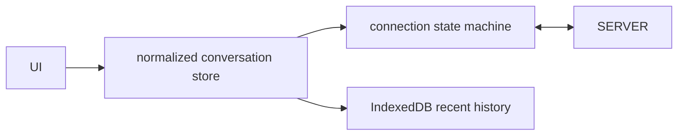

# Realtime Chat Client

## Goals
Build a realtime client that remains correct through disconnects, duplicates, reordered acknowledgements and tab lifecycle changes.

## Requirements
Authentication, rooms, message history, optimistic sends, delivery status, typing indicators, reconnect/resume, unread counts and attachment metadata.

## User Stories
A user sees a pending message immediately, receives one durable copy after reconnect and can navigate messages using keyboard/screen reader.

## Architecture


## Directory Structure
```text
src/realtime/{socket.js,protocol.js,reconnect.js}
src/state/{store.js,reducer.js,selectors.js}
src/ui/{room-list.js,message-list.js,composer.js}
src/data/{history-cache.js,http-client.js}
```

## Module Boundaries
Protocol validates frames; socket owns transport/state; reducer owns deterministic message transitions; HTTP loads history; UI renders selectors.

## State Model
Connection: idle, connecting, authenticated, resuming, open, backoff, offline, closed. Message: pending, sent, delivered, failed.

## Data Model
Message: `{clientId,serverId,roomId,senderId,body,createdAt,sequence,status}`. Rooms track lastSequence and unread marker.

## APIs
`connect({token,signal})`, `send(command)`, `subscribe(event)`, `loadHistory(room,cursor,{signal})`; protocol frames carry type/version/id.

## Validation
Validate every inbound frame and size, allowlist event types, reject invalid URLs/attachments and treat server text as plain text.

## Error Handling
Reconnect with capped jitter, resume from last sequence, deduplicate by IDs, mark permanent send rejection, and stop on auth failure until refresh.

## Accessibility
Use log/feed semantics carefully, announce new messages only when appropriate, preserve reading position, label delivery status and provide non-pointer controls.

## Security
Use WSS, short-lived authentication, server authorization per room/message, origin checks, output-safe rendering and rate/size limits. Do not trust client sequence or sender IDs.

## Performance
Window long histories, batch incoming render commits, pause typing events in hidden tabs, bound caches and avoid one DOM listener per message.

## Testing
Protocol schema tests, simulated duplicate/reorder/disconnect tests, fake-clock backoff tests and browser focus/live-region tests.

## Deployment
Configure CSP connect-src, environment socket URL, telemetry sampling and compatibility fallback such as SSE plus HTTP send if required.

## Failure Scenarios
Connection drops after server accepted send but before acknowledgement, missed sequence gap, token expiry, duplicate tabs and server restart.

## Extensions
End-to-end encryption, reactions, threads, presence, SharedWorker single socket and offline outbox.

## Interview Discussion Points
Explain exactly-once illusion versus idempotency, sequence recovery, optimistic reconciliation, backpressure and accessible live updates.
