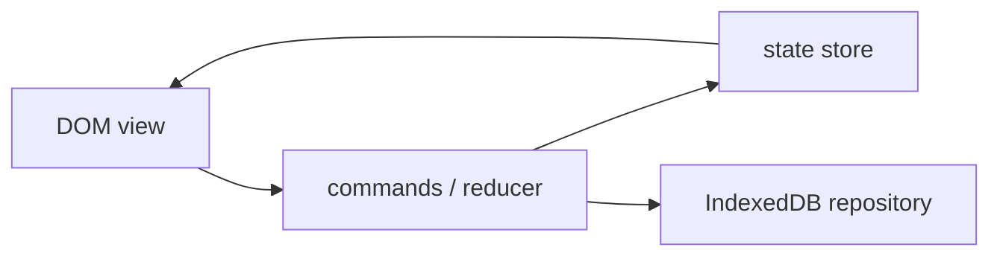

# Vanilla JavaScript Task Manager

## Goals
Build a framework-free CRUD application that teaches DOM rendering, accessible forms, immutable state transitions, IndexedDB persistence and testable module boundaries.

## Requirements
Create, edit, complete, filter and delete tasks; support due dates, tags, URL-backed filters, offline persistence, undo for destructive actions and import/export.

## User Stories
A keyboard user can add a task and return focus to the list. A user can reload offline without losing work. A user can undo a mistaken delete before the undo window expires.

## Architecture


## Directory Structure
```text
src/{app.js,state.js,commands.js}
src/ui/{task-form.js,task-list.js,announcer.js}
src/data/{task-repository.js,migrations.js}
tests/{state.test.js,repository.test.js,e2e.spec.js}
```

## Module Boundaries
UI modules emit intent and render state; the reducer is pure; repository modules own persistence and schema migration; app.js composes them.

## State Model
`{tasks, filter, editingId, pendingUndo, persistenceStatus}`. Commands produce explicit transitions; derived filtered lists are not duplicated in state.

## Data Model
Task: `{id,title,details,status,dueAt,tags,createdAt,updatedAt,version}`. Store timestamps as ISO instants and preserve a schema version.

## APIs
`taskRepository.list/save/remove/transaction`, `dispatch(command)`, and `subscribe(listener)`. Return Promises from persistence and accept AbortSignal for import/export.

## Validation
Trim titles, enforce length and valid dates, reject malformed import records, and validate again before persistence.

## Error Handling
Keep optimistic UI changes reversible. Surface storage quota/migration failure with retry/export options and preserve the cause in protected logs.

## Accessibility
Use labels, buttons, list semantics, live announcements for add/delete, visible focus, logical tab order and focus restoration after editing/undo.

## Security
Render all task content with `textContent`; never interpret imported text as HTML; cap imported file size and reject dangerous object keys.

## Performance
Render keyed changes rather than replacing the whole list for every keystroke; debounce persistence only when crash-loss policy allows it; paginate or virtualize only after measurement.

## Testing
Unit-test transitions and date rules, integration-test IndexedDB via a browser environment, and run Playwright keyboard/offline journeys.

## Deployment
Bundle as static ESM assets, configure immutable hashed caching, add a CSP and deploy to GitHub Pages or another static host.

## Failure Scenarios
Quota exceeded, interrupted migration, duplicate import IDs, stale edit after another tab update, timer firing after teardown, and unavailable storage.

## Extensions
Recurring tasks, BroadcastChannel synchronization, service-worker shell caching and conflict resolution.

## Interview Discussion Points
Explain state ownership, undo design, schema migration, safe rendering, why IndexedDB beats localStorage, and how you would scale to multi-device sync.
