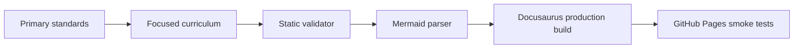

# JavaScript Specification Coverage 2026

**Research date:** August 2, 2026.

## Authority map

| Topic | Primary authority |
|---|---|
| syntax, types, objects, functions, modules, Promises | ECMA-262 |
| internationalization | ECMA-402 |
| proposal maturity | TC39 process and proposal repositories |
| event loops, HTML modules and browser integration | WHATWG HTML |
| DOM, events and AbortController | WHATWG DOM |
| Fetch and Streams | WHATWG Fetch and Streams |
| accessibility | W3C WAI guidance and HTML semantics |
| runtime behavior | official Node.js, Deno, Bun and browser-vendor documentation |
| security | OWASP and relevant Web standards |

## Canonical route coverage

The focused curriculum provides canonical pages for introduction, version, roadmap, variables, operators, control flow, types, functions, scope/closures, objects, prototypes, classes, arrays/collections, Promises/async-await, event loop, modules, DOM, browser APIs, errors, testing, debugging, performance, security, execution contexts, memory/GC, patterns, architecture, interviews and projects.

The original 97-topic bundled curriculum remains available for broad sequential coverage. Existing project, question-bank and mock-interview routes remain compatible.

## Modern feature status

- ECMAScript 2026 / ECMA-262 17th edition is the annual stable baseline.
- The living specification is the ECMAScript 2027 draft.
- Temporal and explicit resource management are finished Stage-4 work in the living-draft period and require target checks.
- Decorators remain a proposal at Stage 2.7 and are labelled accordingly.
- Browser and runtime APIs are not mislabelled as ECMAScript language features.

## Quality checks

The dedicated validator calculates document/sidebar/Mermaid/project/exercise counts from the repository. It rejects placeholders, unbalanced fences, duplicate IDs/slugs, missing canonical documents, missing project headings, insufficient exercise entries, numeric focused labels, broken sidebar references and missing navigation/workflow integration.

## Known boundary

Compatibility changes over time. The version page records the research date and teaches a target-validation workflow instead of claiming that every standardized feature is universally deployed.
