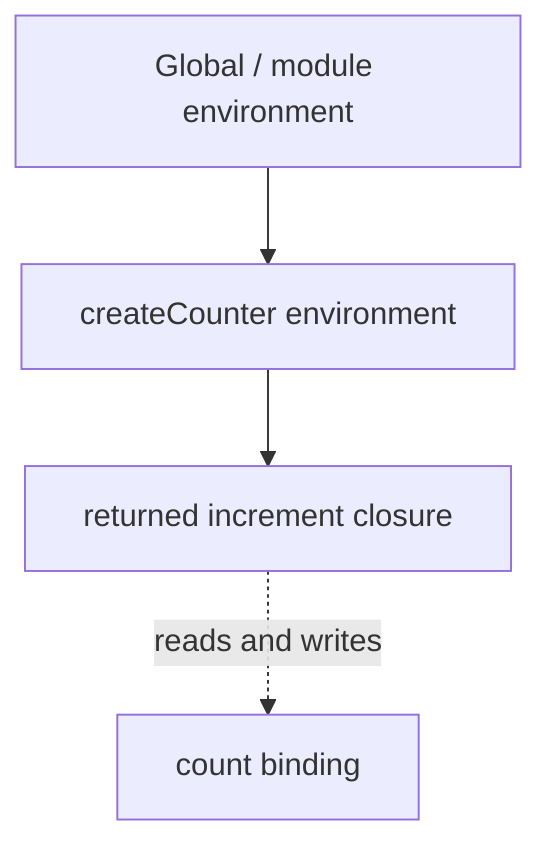

# Scope and Closures

Lexical scope is determined by source structure. An execution context refers to a lexical environment whose environment record stores bindings and whose outer reference forms the scope chain.



```javascript
function createCounter(start = 0) {
  let count = start
  return {
    increment() { return ++count },
    value() { return count },
  }
}

const counter = createCounter(10)
counter.increment() // 11
```

The returned methods keep the needed environment reachable after `createCounter` finishes. A closure stores access to bindings, not a frozen snapshot of their values.

## Scope kinds

JavaScript has global, function, block and module scope. `var` is function-scoped; lexical declarations and class declarations are block-scoped. Modules have private top-level bindings and are strict.

## Hoisting without folklore

Declarations are processed during environment setup. Function declarations become callable early; `var` bindings are initialized to `undefined`; lexical and class bindings exist but remain uninitialized until evaluation reaches them. Reading an uninitialized lexical binding throws because it is in the temporal dead zone.

## Loop closures

`let` in a `for` loop can create a fresh binding for each iteration. `var` shares one function binding.

```javascript
const handlers = []
for (let index = 0; index < 3; index += 1) {
  handlers.push(() => index)
}
console.log(handlers.map(fn => fn())) // [0, 1, 2]
```

## Memory behavior

Closures retain only what remains reachable through their environment, but one captured binding can indirectly retain a large object graph. Clear listeners, timers and caches, and avoid capturing full request or DOM objects when a small immutable value is enough.

## Encapsulation choices

Use module-private bindings for service-wide implementation details, factory closures for per-instance private state, and class private fields when class identity is part of the design. Do not rely on IIFEs merely to simulate modules in modern code.

## Debugging

Inspect the browser or Node debugger’s Scope panel, pause inside the callback, and identify the exact binding resolved at each outer environment. For leaks, use heap snapshots and retaining paths rather than assuming every closure is a leak.

## Primary references

- [ECMA-262 execution contexts](https://tc39.es/ecma262/#sec-execution-contexts)
- [MDN closures](https://developer.mozilla.org/docs/Web/JavaScript/Guide/Closures)
