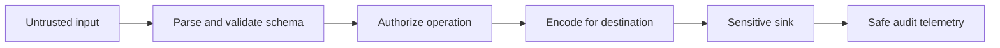

# JavaScript Security

Security begins with trust boundaries: data from users, URLs, storage, messages, APIs and packages is untrusted until validated for its destination.

## XSS and injection

DOM-based XSS occurs when attacker-controlled data reaches an executable HTML/URL/script sink.

```javascript
// vulnerable
results.innerHTML = `<li>${query}</li>`

// safe for text
const item = document.createElement('li')
item.textContent = query
results.replaceChildren(item)
```

When rich HTML is required, use a maintained sanitizer configured for the context. Content Security Policy reduces impact; Trusted Types can enforce safe DOM sinks. Neither replaces output encoding and input/schema validation.

Never use `eval`, string timers or `new Function` on untrusted text. Avoid dynamic script URLs and validate URL protocols with the URL parser.

## Browser boundaries

CORS controls which origins may read responses; it is not authentication and does not block requests. CSRF defenses commonly combine SameSite cookies, anti-CSRF tokens and origin checks. Frame restrictions (`frame-ancestors`) address clickjacking.

For `postMessage`, send to an exact target origin and verify `event.origin`, `event.source` and payload schema. Protect WebSocket handshakes and messages with authentication, authorization, origin policy, limits and validation.

## Tokens and storage

Frontend code cannot keep a deployed secret. Prefer secure, HttpOnly, SameSite cookies for browser sessions where architecture permits. localStorage is readable by successful XSS. Keep token lifetime and privileges minimal and rotate/revoke server-side.

## Prototype pollution

Merging attacker-selected paths can modify prototypes and alter authorization/configuration behavior. Construct allowlisted records, reject dangerous keys and use patched libraries/null-prototype dictionaries where appropriate.

## Regular expressions

Bound attacker-controlled input and avoid ambiguous nested repetition that enables ReDoS. Use parsers for structured formats and test worst cases.

## Supply chain

- minimize dependencies and maintainers with publish rights;
- commit lockfiles and use reproducible CI installs;
- review lifecycle scripts and newly introduced transitive packages;
- enable provenance/signing where supported;
- scan for typosquatting, compromised releases and secrets;
- pin Actions and deployment permissions appropriately.

Subresource Integrity protects eligible cross-origin static resources; it does not validate dynamic API data.

## Secure review flow



## Primary references

- [OWASP JavaScript security](https://cheatsheetseries.owasp.org/)
- [OWASP DOM XSS prevention](https://cheatsheetseries.owasp.org/cheatsheets/DOM_based_XSS_Prevention_Cheat_Sheet.html)
- [MDN web security](https://developer.mozilla.org/docs/Web/Security)
