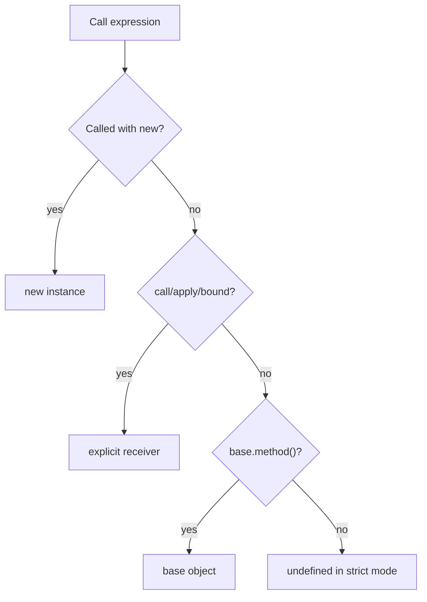

# `this`, `call`, `apply` and `bind`

For ordinary functions, `this` is determined primarily by **how the function is called**, not where it was written. Arrow functions do not create their own `this`; they close over the surrounding one.

## Binding rules



```javascript
const account = {
  owner: 'Salman',
  describe() { return `${this.owner}'s account` },
}

account.describe() // implicit receiver: account
const detached = account.describe
// detached() // TypeError in strict/module code because this is undefined
```

`call` passes arguments individually; `apply` accepts an iterable-like argument list; `bind` returns a new function with a fixed receiver and optional leading arguments.

```javascript
function greet(greeting, punctuation) {
  return `${greeting}, ${this.name}${punctuation}`
}
const person = {name: 'Amina'}
greet.call(person, 'Hello', '!')
greet.apply(person, ['Welcome', '.'])
const welcomeAmina = greet.bind(person, 'Welcome')
```

## Arrows

Arrows are ideal for callbacks that should inherit a surrounding receiver. Do not use an arrow as an object method when the method should receive its object dynamically.

## Constructors

`new Fn()` creates an object linked to `Fn.prototype`, binds it as `this`, evaluates the function, and normally returns the new object. An explicit returned object replaces it. `new.target` reveals whether construction occurred.

## Event handlers

DOM listeners called by the browser commonly receive the current target as `this` for ordinary functions, but framework wrappers and detached callbacks may differ. Prefer the event object (`event.currentTarget`) when it communicates intent more clearly.

## Method borrowing and private state

Borrowing generic built-in methods can be valid when their receiver contract permits it. Class private fields perform a brand check, so a method using `#field` cannot be borrowed onto an arbitrary look-alike object.

## Common mistakes

- binding a method repeatedly during every render or removal attempt;
- losing the receiver when passing `object.method` as a callback;
- assuming `bind` changes an arrow’s lexical `this`;
- using `this` when a plain parameter would make dependency flow clearer.

## Primary references

- [ECMA-262 ordinary calls](https://tc39.es/ecma262/#sec-ordinarycallbindthis)
- [MDN this](https://developer.mozilla.org/docs/Web/JavaScript/Reference/Operators/this)
