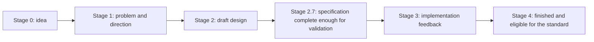

# JavaScript Version and Platform Support

**Research date:** August 2, 2026.

This page is the production baseline for the handbook. It separates the annual ECMAScript standard, the continuously updated living specification, host APIs, and implementation support.

## Current language baseline

| Layer | Current baseline | Handbook treatment |
|---|---|---|
| Published language standard | **ECMAScript 2026, ECMA-262 17th edition** | Stable language baseline |
| Living specification | **ECMAScript 2027 draft** | Includes finished Stage-4 work after the 2026 snapshot |
| Internationalization | **ECMA-402 2026, 13th edition** | Standardized; locale data still depends on the implementation |
| Web platform | WHATWG HTML, DOM and Web API standards | Host-specific, not part of ECMA-262 |
| Node.js, Deno and Bun | Runtime APIs and compatibility layers | Runtime-specific; verify the selected release |

ECMAScript 2026 added `Math.sumPrecise`, `Iterator.concat`, `Array.fromAsync`, `Error.isError`, Map and WeakMap get-or-insert methods, Uint8Array base64/hex conversion methods, JSON parse source context, and raw JSON support.

ECMAScript 2025 standardized iterator helpers, Set methods, import attributes and JSON modules, `RegExp.escape`, inline RegExp modifiers, `Promise.try`, and Float16 APIs. ECMAScript 2024 standardized resizable and transferable ArrayBuffers, `Promise.withResolvers`, grouping APIs, `Atomics.waitAsync`, and well-formed Unicode string helpers.

## Stable feature map

| Feature | Status | Compatibility guidance |
|---|---|---|
| Optional chaining and nullish coalescing | Standardized | Broadly supported; transpile only for older targets |
| Logical assignment operators | Standardized | Broadly supported |
| Public/private class fields and static blocks | Standardized | Use normally on maintained runtimes |
| Top-level `await` | Standardized | Module-only; understand dependency-graph blocking |
| Import attributes and JSON modules | Standardized | Host loading behavior remains compatibility-sensitive |
| Iterator helpers and Set methods | Standardized | Check older browsers and maintained Node lines |
| `Promise.withResolvers` and `Promise.try` | Standardized | Prefer feature detection for mixed deployment fleets |
| Resizable/transferable ArrayBuffers | Standardized | Engine support and security constraints still matter |
| Explicit resource management | Stage 4 / living draft | Use only where syntax and runtime support are verified |
| Temporal | Stage 4 / living draft | Compatibility-sensitive; not yet universal across Safari-era fleets |
| Decorators | Stage 2.7 proposal | Do not present as standard JavaScript |
| Async iterator helpers | Proposal | Experimental; keep behind tool/runtime-specific boundaries |

## TC39 maturity model



A proposal can have an implementation before Stage 4. That does not make it universally stable. The handbook labels proposal status explicitly and never treats one browser implementation as proof of portability.

## Language versus host environment

```text
ECMA-262                              Browser / runtime host
-----------------------------------   --------------------------------------
Array, Map, Promise, modules          DOM, fetch, timers, rendering
functions, classes, coercion          filesystem, process, sockets
Jobs and module evaluation            task queues, event-loop phases, I/O
```

`fetch`, `AbortController`, Web Streams and `structuredClone` are standardized Web APIs that multiple runtimes implement. Their presence does not make them ECMAScript language features, and their exact integration can differ by host.

## Production compatibility strategy

1. Define supported browser and runtime versions.
2. Separate syntax support, built-in support and host-API support.
3. Use feature detection for optional APIs; do not use user-agent guesses as the primary control.
4. Test module loading, import attributes, top-level await and workers in real target environments.
5. Pin runtime versions in CI and deployment images.
6. Review TC39 status before adopting new syntax that cannot be polyfilled.
7. Record fallbacks and removal dates for compatibility code.

```javascript
export function hasModernCloneSupport() {
  return typeof globalThis.structuredClone === 'function'
}

export function clonePortable(value) {
  if (!hasModernCloneSupport()) {
    throw new Error('structuredClone is required by this application baseline')
  }
  return structuredClone(value)
}
```

## Upgrade checklist

- Read the annual ECMA-262 change summary and runtime release notes.
- Run unit, integration, browser and performance tests on old and new targets.
- Check parsing failures separately from missing runtime APIs.
- Validate serialization, RegExp, Intl, module and async-ordering behavior.
- Canary before broad rollout and retain a rollback path.

## Primary sources

- [ECMAScript 2026 specification](https://tc39.es/ecma262/2026/)
- [Living ECMAScript specification](https://tc39.es/ecma262/)
- [TC39 process](https://tc39.es/process-document/)
- [TC39 proposals](https://github.com/tc39/proposals)
- [Temporal proposal](https://github.com/tc39/proposal-temporal)
- [MDN JavaScript](https://developer.mozilla.org/docs/Web/JavaScript)
- [WHATWG HTML](https://html.spec.whatwg.org/)
