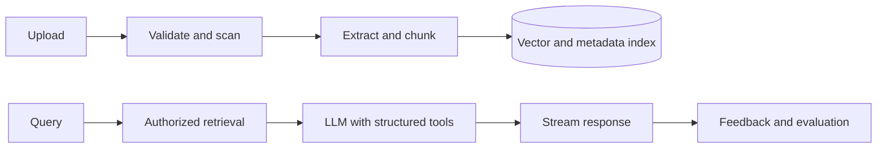

# Capstone: AI-Powered Application

## Requirements

Build a document assistant with uploads, extraction, retrieval, citations, streaming answers, tool calls, conversation history, feedback, and evaluation.

## Architecture

## Boundaries

Next.js handles authenticated UI, upload initiation, conversation routes, and server-side tool execution. Durable workers handle extraction, embedding, and long-running generation. Retrieval always filters by tenant, user, document permission, and deletion state.

## Security

Treat documents and model output as untrusted. Defend against prompt injection, isolate tools, authorize every tool call, restrict outbound requests, scan uploads, redact secrets, and never expose provider keys to the browser.

## Reliability and cost

Set input/output token limits, timeouts, cancellation, model fallback, retry rules, and per-tenant quotas. Persist run state so a page refresh does not lose a long task.

## Evaluation

Maintain datasets for retrieval relevance, citation support, answer correctness, refusal, injection resistance, tool selection, latency, and cost. Gate prompt/model changes through offline evaluation and controlled rollout.

## Observability

Trace retrieval, model, tool, and streaming stages with redaction. Record model/version, token usage, latency, tool decisions, errors, and user feedback.

## Extensions

Add multimodal documents, human approval for high-impact tools, agent workflows, semantic cache, and provider routing.