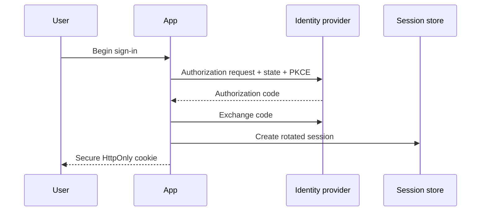

# Capstone: Authentication System

## Requirements

Support registration, email verification, password login, OAuth/OIDC, passkeys or MFA, password reset, session management, account linking, logout, and security audit events.

## Flow

## Architecture

Use a mature provider when it meets requirements; custom authentication carries cryptography, recovery, abuse, and compliance responsibilities. Centralize session parsing in server-only code, but repeat authorization at every protected resource.

## Security

Hash passwords with a current password-hashing function, rate limit and monitor login/reset flows, rotate sessions after privilege changes, use secure host-scoped cookies, validate OAuth state/nonce/PKCE, prevent account-linking confusion, and avoid user enumeration.

## Caching

Authentication and user-specific data must not leak through public caches. Understand how cookies and request APIs affect rendering.

## Testing

Cover fixation, replay, expired verification, reset token reuse, OAuth denial, linked-account conflict, logout on multiple devices, CSRF, open redirects, and authorization after account disablement.

## Operations

Audit security events, protect logs, alert on abuse patterns, document key rotation, and maintain incident procedures for credential or provider compromise.

## Extensions

Add device management, recovery codes, step-up authentication, organization SSO, SCIM, and risk-based challenges.