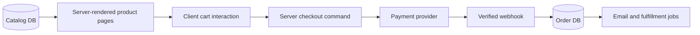

# Capstone: E-commerce Store

## Requirements

Build catalog, search, product variants, cart, checkout, inventory, orders, customer accounts, promotions, and transactional email.

## Architecture

## Routes and boundaries

Catalog and product detail are Server Components with cached public data. Variant selection and cart controls are client islands. Checkout, pricing, discounts, inventory reservation, and order creation run on the server.

## Security

Never trust browser prices, currency, discount, inventory, or payment status. Recalculate the order server-side, authorize account access, protect guest order lookup with strong tokens, and verify payment webhooks using raw bodies.

## Caching

Cache catalog read models by product/category tags. Inventory and personalized pricing require stricter freshness. Mutation workflows invalidate exact product and cart views rather than the entire site.

## Reliability

Use idempotency keys for checkout and webhook events. Model order states explicitly. Reconcile payment, inventory, and fulfillment when providers disagree.

## Testing and operations

Test concurrent inventory, duplicate checkout, webhook replay, failed payment, tax/shipping errors, accessibility, and rollback. Monitor conversion, checkout latency, payment failures, inventory drift, queue age, and webhook backlog.

## Extensions

Add wishlists, recommendations, subscriptions, returns, multi-currency, regional catalogs, and fraud review.