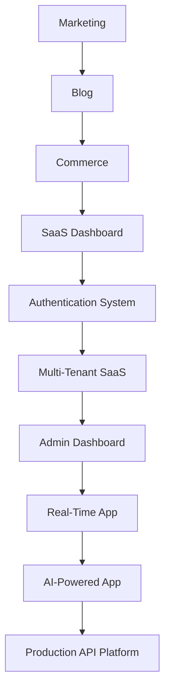

# Capstone Projects

The ten capstones turn isolated APIs into complete architecture decisions. Each guide includes routes, boundaries, data, security, caching, mutations, testing, deployment, observability, and extension work.

Build them in order or use the later projects as system-design exercises. For every capstone, produce an ADR for rendering, caching, authorization, and deployment.