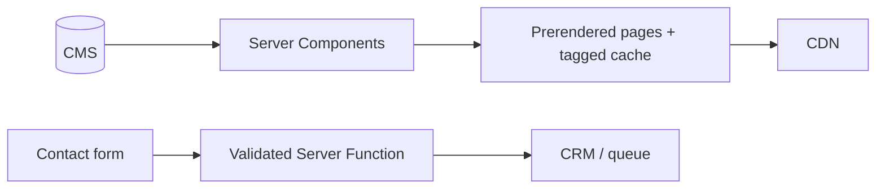

# Capstone: Marketing Website

## Requirements

Build product pages, pricing, customer stories, localized landing pages, a contact form, sitemap, structured data, and campaign attribution. Editors publish through a CMS.

## Architecture



## Route structure

```text
app/[locale]/
  layout.tsx
  page.tsx
  pricing/page.tsx
  customers/[slug]/page.tsx
  contact/page.tsx
  sitemap.ts
```

## Boundaries and data

Pages are Server Components. Only navigation, consent controls, calculators, and form feedback are client islands. CMS data uses a server-only client, a runtime schema, tags by content ID, and on-demand revalidation from a verified CMS webhook.

## Security and mutations

Validate contact data, rate limit by multiple signals, use a honeypot or challenge where abuse requires it, and enqueue CRM/email side effects. Never expose CMS or CRM credentials.

## Testing and performance

Test metadata, canonical URLs, locale alternates, sitemap, structured data, form validation, keyboard navigation, and webhook invalidation. Set budgets for LCP image size, client JavaScript, fonts, and third-party scripts.

## Deployment and observability

Deploy to a CDN-backed Node or platform runtime. Monitor Web Vitals, CMS latency, revalidation failures, form abuse, CRM delivery, and broken links.

## Extensions

Add experimentation with stable variant assignment, preview mode for editors, campaign landing-page templates, and a visual regression suite.