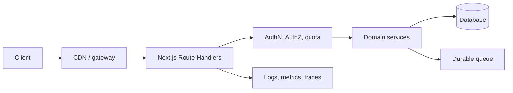

# Capstone: Production API Platform

## Requirements

Expose versioned REST endpoints, API keys/OAuth, quotas, webhooks, idempotent mutations, streaming endpoints, SDK generation, documentation, and operational SLOs.

## Architecture

## HTTP contracts

Use correct methods, status codes, content types, conditional requests, pagination, error schemas, request IDs, and deprecation headers. Validate path, query, headers, and body. Generate OpenAPI from a reviewed contract or verify implementation against the spec.

## Security

Hash stored API keys, show secrets once, support rotation and revocation, scope permissions, rate limit by account and credential, prevent SSRF, verify webhooks, and redact authorization data.

## Reliability

Apply idempotency keys to retried writes, use transactions and outbox events, set timeouts, bound retries, and expose asynchronous operations as jobs with status endpoints.

## Testing

Run contract, authorization, quota, replay, concurrency, pagination, streaming, webhook, and backward-compatibility tests. Add load tests with realistic database and downstream behavior.

## Deployment and SLOs

Deploy multiple stateless instances behind a proxy with shared durable state. Define availability and latency SLOs, error budgets, dashboards, alerts, runbooks, and rollback.

## Extensions

Add GraphQL or event subscriptions, customer-specific quotas, regional routing, usage billing, SDK release automation, and a developer portal.