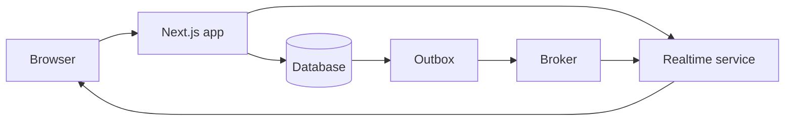

# Capstone: Real-Time Application

## Requirements

Build a collaborative activity feed or operations board with presence, live updates, optimistic commands, reconnect behavior, and notification preferences.

## Architecture

Next.js owns pages, authentication, commands, and initial snapshots. A dedicated realtime service or managed provider owns long-lived connections and fan-out.

## Consistency

Every event has an ID, tenant, aggregate version, and timestamp. Clients deduplicate, order where required, and refetch after gaps. Optimistic UI reconciles against authoritative server events.

## Security

Authorize channel subscriptions and each command. Use short-lived connection tokens with tenant/resource claims. Never trust a client-supplied room name without checking membership.

## Failure handling

Design reconnect backoff, offline indication, missed-event recovery, duplicate delivery, provider outage, and degraded polling fallback.

## Testing and observability

Test concurrent edits, reordering, replay, reconnect, stale permissions, and multi-tab behavior. Monitor active connections, publish latency, dropped messages, reconnect rate, authorization failures, and event lag.

## Extensions

Add collaborative cursors, conflict-free data types where justified, presence privacy, mobile push, and regional realtime routing.