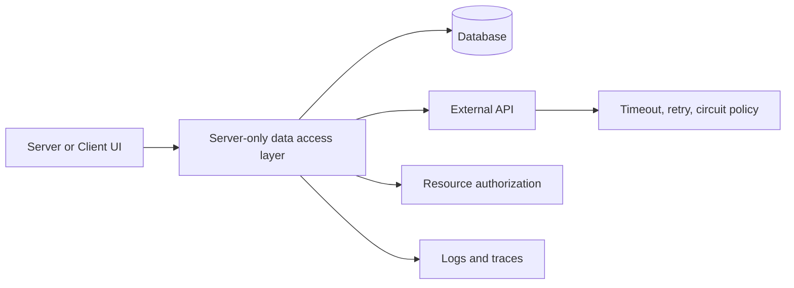

# Database and API Integration

Next.js can access databases and private services directly from server code. That reduces unnecessary HTTP hops, but it also makes connection management, authorization, timeouts, and observability application responsibilities.

Keep credentials and privileged clients in `server-only` modules. Validate all external input and return minimal DTOs to the UI.