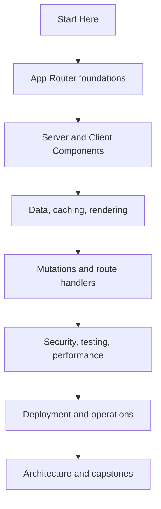

# Complete Next.js Handbook Coverage

This completion layer closes the topics that sit across several existing chapters or need an explicit production reference. It supplements the focused App Router curriculum rather than replacing it.

## How the handbook is organized

The primary path is App Router first. Pages Router material is isolated under compatibility and migration. Production guidance assumes TypeScript, React Server Components, server-side authorization, runtime validation, observability, and an explicit caching decision.

## Completion modules

- **Version and roadmap:** the exact framework, React, Node.js, and tooling baseline.
- **Installation and setup:** `create-next-app`, manual setup, package managers, editor and debugging workflows.
- **Styling:** global CSS, CSS Modules, Tailwind CSS, Sass, CSS-in-JS, design systems, and hydration risks.
- **State management:** server state, URL state, local state, Context, Zustand, Redux Toolkit, TanStack Query, and SWR.
- **Request and configuration:** cookies, headers, request metadata, environment variables, and `next.config`.
- **Data platform:** databases, external APIs, realtime transports, webhooks, and AI integrations.
- **TypeScript and accessibility:** strict types, runtime validation, keyboard/focus behavior, and accessible dynamic UI.
- **Platform patterns:** Edge runtime, internationalization, multi-tenancy, and monorepos.
- **Compatibility and migration:** Pages Router, Vite/CRA migration, App Router migration, upgrades, and rollback.
- **Production patterns:** jobs, queues, uploads, email, payments, flags, search, AI features, and audit logs.
- **Capstones:** ten architecture guides that apply the curriculum end to end.

## Quality contract

Every production example should answer five questions:

1. Where does this code execute?
2. Which data is trusted, validated, and authorized?
3. What is cached, for how long, and how is it invalidated?
4. What fails, and how is the failure observed and recovered?
5. What changes when the application runs on multiple instances?

Use the [completion matrix](./reference/completion-matrix) to map the specification to focused lessons.