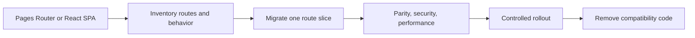

# Pages Router Compatibility and Migration

Pages Router remains relevant for maintenance and incremental migration. New learning and new architecture in this handbook use App Router.

The migration goal is not a mechanical file move. It is a controlled change in routing, data ownership, rendering, caching, mutation, and error-handling models.

Keep both routers only as long as the migration requires, and define rollback before changing production traffic.