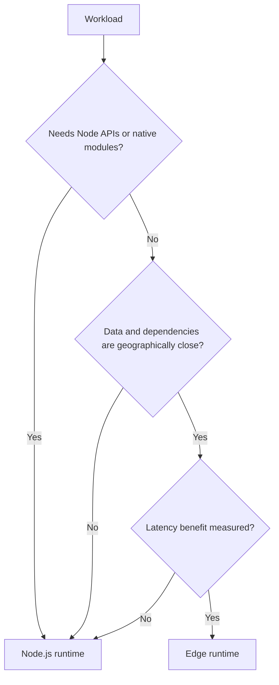

# Edge Runtime

The Edge runtime executes close to users with Web Platform APIs and a restricted Node.js surface. It can reduce network latency for lightweight request processing, but it is not automatically faster or cheaper.

## Good candidates

- Geographically distributed redirects or rewrites.
- Lightweight authentication gating using edge-compatible verification.
- Localization and tenant routing.
- Small Route Handlers that call nearby HTTP services.
- Streaming work supported by the platform.

## Poor candidates

- Packages that require unsupported Node.js APIs or native modules.
- Long CPU-intensive work.
- Database drivers without edge support.
- Large dependency graphs with expensive cold starts.
- Work that immediately calls a single-region database, erasing the latency benefit.

## Decision guide

## Security and operations

Use Web Crypto correctly, limit outbound destinations, validate all request data, and keep secrets within platform-supported bindings. Measure cold starts, regional errors, dependency size, and upstream latency.

Choose Edge only after a representative benchmark. Keep a Node fallback plan for incompatible dependencies and migrations.